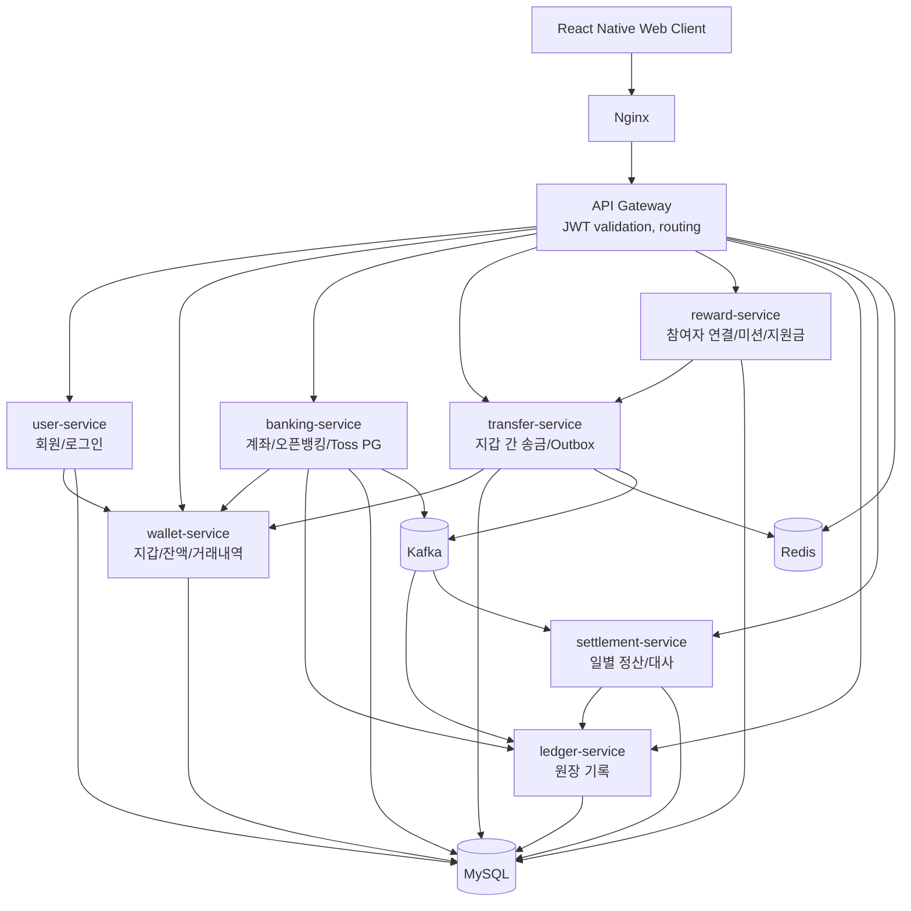
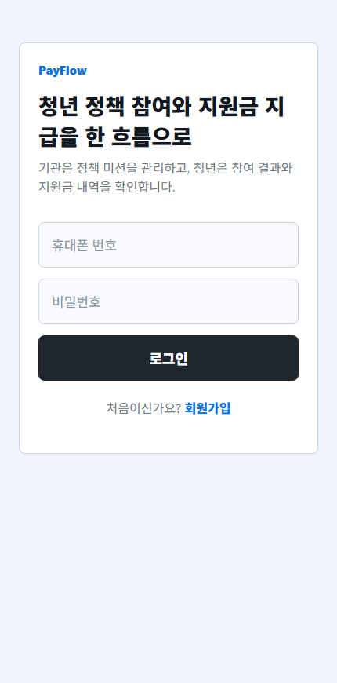
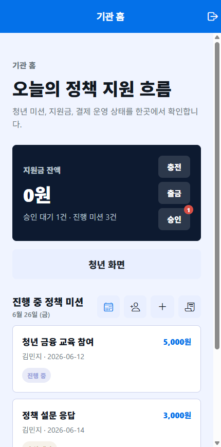
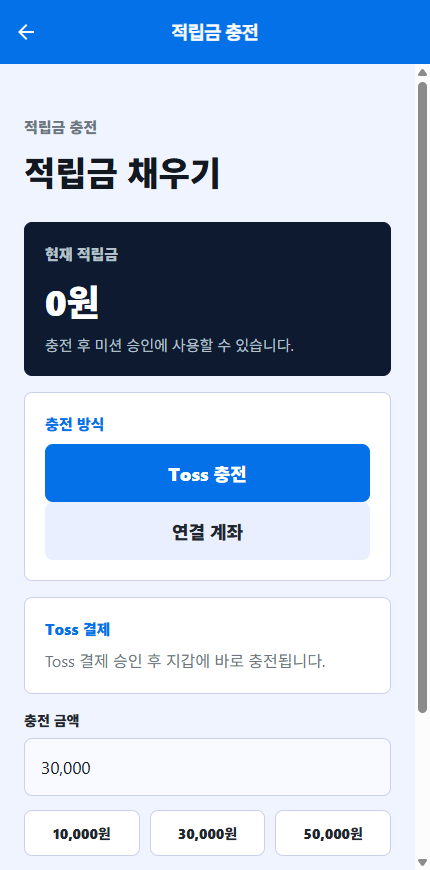
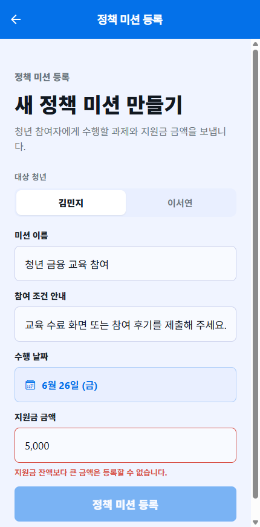
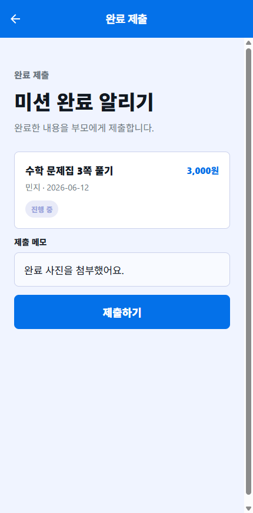
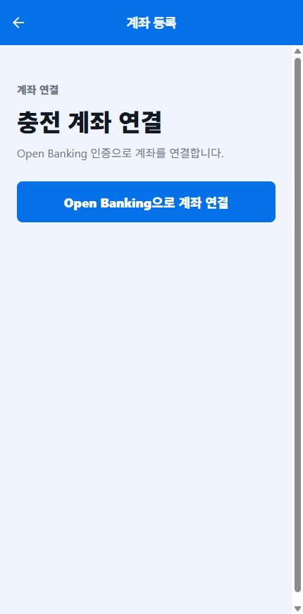

# PayFlow

> 청년 정책 참여 미션과 지원금 지급을 지갑, 송금, 오픈뱅킹, PG 결제, 정산 도메인으로 풀어낸 MSA 기반 결제 시스템


## 개요

PayFlow는 정책 미션 완료 후 지원금을 지급하는 시나리오를 바탕으로 만든 결제/송금 시스템입니다.
회원, 지갑, 송금, 외부 금융 연동, 원장, 정산, 보상 처리를 서비스 단위로 분리했습니다.

| 항목 | 구현 |
| --- | --- |
| 중복 지급 방지 | 멱등키, 요청 해시, 지갑 참조키, 미션별 지급키 적용 |
| 잔액 추적 | 지갑 거래 이력과 원장 기록 분리 |
| 외부 API 상태 관리 | 성공, 실패, 처리중, 타임아웃, 불명확 상태 분리 |
| 보상 처리 | `COMPENSATION_REQUIRED` 상태와 환불 API |
| 정산 | Toss PG 승인/취소 이벤트 수집, 일별 정산 배치, 원장 대사 |
| 문서화 | 도메인 흐름, API 명세, ERD, 보안 리뷰, 테스트 증적 |

## 문제 정의

결제와 송금 기능은 승인 API 호출만으로 끝나지 않습니다.
PayFlow에서는 다음 상황을 명시적으로 처리했습니다.

- 같은 요청이 재시도되어도 잔액이 한 번만 변경되어야 한다.
- 은행이나 PG 응답이 애매하면 실패로 확정하지 않고 조회 가능한 상태로 남겨야 한다.
- DB 저장과 메시지 발행이 서로 다른 시점에 실패할 수 있다.
- 출금 이후 입금이 실패한 거래는 별도 보상 절차가 필요하다.
- 결제 이벤트와 내부 원장은 정산 시점에 다시 맞춰봐야 한다.

## 거래 처리 설계

PayFlow의 비즈니스 시나리오는 "청년 정책 미션 지원금 지급"이지만, 내부 흐름은 충전, 송금, 원장 기록, 정산, 보상으로 이어지는 거래 처리 파이프라인으로 구성했습니다.

```text
외부 결제/은행 거래 요청
-> 거래 식별자 생성
-> 멱등성 검증
-> 외부 API 응답 상태 해석
-> 내부 지갑 잔액 반영
-> 원장 기록
-> 이벤트 발행
-> 정산 배치
-> 누락/불일치 대사
-> 실패 거래 보상
```

| 설계 항목 | PayFlow에서의 구현 |
| --- | --- |
| 결제 승인 | Toss PG 결제 준비/승인/취소와 webhook 이벤트 수집 |
| 은행 거래 상태 관리 | 오픈뱅킹 응답을 최종 성공, 실패, 처리중, 모호한 상태로 분리 |
| 멱등성 | API 멱등키, 요청 해시, `bank_tran_id`, 지갑 참조키로 중복 거래 방어 |
| 지갑/원장 정합성 | 지갑 잔액 변경과 원장 기록을 분리해 추적 가능성 확보 |
| 이벤트 신뢰성 | Transactional Outbox로 DB 커밋과 Kafka 발행 사이의 불일치 완화 |
| 정산 대사 | 결제 이벤트와 내부 원장을 일별 배치에서 대사 |
| 보상 처리 | 부분 실패 거래를 `COMPENSATION_REQUIRED`로 격리하고 환불 API 제공 |
| 민감정보 처리 | 오픈뱅킹 토큰 암호화, 계좌번호 원문 미저장, 로그 민감정보 최소화 |

결제 승인 이후에도 거래 기록, 대사, 복구 절차가 이어지도록 구성했습니다.

## 구현 내용

| 구분 | 내용 |
| --- | --- |
| MSA 구조 | `api-gateway`, `user`, `wallet`, `banking`, `transfer`, `ledger`, `settlement`, `reward` 서비스 분리 |
| 인증/인가 | JWT 검증을 Gateway에서 수행하고 내부 서비스에는 사용자 식별 헤더와 내부 호출 시크릿 전달 |
| 지갑 정합성 | 입금/출금 이력을 `referenceType + referenceId`로 관리해 중복 잔액 반영 방지 |
| 송금 안정성 | Redis 분산 락, 멱등키, 실패 상태 분리, 보상 환불 플로우 구현 |
| 이벤트 처리 | Transactional Outbox로 송금 성공/실패 이벤트를 저장한 뒤 Kafka로 발행 |
| 원장 기록 | 송금/충전 이벤트를 ledger-service에서 별도 원장 엔트리와 라인으로 보관 |
| 오픈뱅킹 | 성공/실패/처리중/타임아웃/중복 거래를 구분하고 결과 조회 스케줄러로 최종 상태 확정 |
| Toss PG | 결제 승인/취소 이벤트 수집, 정산 이벤트 발행, 일별 정산 배치와 원장 대사 구현 |
| 민감정보 보호 | 오픈뱅킹 토큰 AES-GCM 암호화, 계좌번호 원문 미저장, 운영 로그에 민감 payload 저장 방지 |
| 테스트 | 서비스별 JUnit 테스트, React Native 타입 체크, Playwright E2E, k6 시나리오 구성 |

## 서비스 아키텍처



## 주요 사용자 흐름

```text
기관 담당자/청년 참여자 회원가입
-> 사용자별 지갑 자동 생성
-> 기관 담당자 지원금 예산 충전
-> 기관 담당자와 청년 참여자 연결
-> 정책 미션 생성
-> 청년 참여자 미션 제출
-> 기관 담당자 승인
-> 지원금 지급 요청
-> transfer-service가 기관 지갑 출금 및 청년 지갑 입금
-> Kafka 이벤트 발행
-> ledger-service 원장 기록
-> 지갑 거래 내역 및 지원금 사용 내역 조회
```

## 금융 도메인 설계

### 1. HTTP 성공과 금융 성공을 분리

오픈뱅킹 API 호출에서 HTTP 200은 은행 거래의 최종 성공을 의미하지 않을 수 있습니다.
PayFlow는 외부 API 응답을 곧바로 성공 처리하지 않고 다음 상태를 구분합니다.

```text
REQUESTED
-> BANK_PROCESSING
-> BANK_SUCCEEDED
-> WALLET_REFLECTING
-> COMPLETED
```

타임아웃이나 애매한 응답은 실패로 단정하지 않고 `UNKNOWN` 또는 `BANK_PROCESSING` 상태로 남겨 결과 조회 스케줄러가 최종 확정합니다.

### 2. 멱등성과 중복 잔액 반영 방지

지원금 지급, 오픈뱅킹 충전, Toss 결제 승인처럼 금액이 움직이는 API는 중복 요청을 방어해야 합니다.

| 계층 | 키 | 목적 |
| --- | --- | --- |
| API 요청 | `Idempotency-Key + requestHash` | 같은 요청 재시도는 기존 결과 반환, 다른 본문이면 충돌 처리 |
| 오픈뱅킹 | `bank_tran_id` | 은행 거래 식별과 결과 조회 기준 |
| 지갑 반영 | `referenceType + referenceId` | 동일 거래의 지갑 잔액 중복 변경 방지 |
| 미션 지급 | `reward-payment-{missionId}` | 같은 미션 지원금 중복 지급 방지 |

### 3. Transactional Outbox 기반 이벤트 발행

송금 성공 후 곧바로 Kafka를 호출하면 DB 커밋과 메시지 발행 사이에서 불일치가 생길 수 있습니다.
PayFlow는 송금 트랜잭션 안에서 `outbox_events`를 먼저 저장하고, 별도 relay가 Kafka로 발행하도록 분리했습니다.

```text
transfer-service DB transaction
-> transfers SUCCEEDED
-> outbox_events PENDING
-> commit
-> OutboxEventRelay
-> Kafka transfer.completed
-> ledger-service 원장 기록
```

### 4. 보상 트랜잭션

출금은 성공했지만 입금 또는 외부 금융 API 결과를 신뢰할 수 없는 경우를 `COMPENSATION_REQUIRED`로 분리합니다.
운영자는 보상 API를 통해 원 거래 키를 기준으로 환불을 수행할 수 있고, 지갑 서비스는 같은 보상 요청이 반복되어도 잔액을 한 번만 반영합니다.

### 5. 정산과 원장 대사

Toss PG 승인/취소 이벤트는 settlement-service로 전달되고, 매일 `01:00 Asia/Seoul` 기준 일별 정산 배치가 수행됩니다.
정산 배치는 결제 이벤트와 원장 기록을 비교해 `MATCHED`, `MISSING_LEDGER`, `AMOUNT_MISMATCH` 상태를 남기고, 승인액/취소액/수수료/예상 지급액을 계산합니다.

## 기술 스택

| 영역 | 기술 |
| --- | --- |
| Backend | Java 21, Spring Boot 4, Spring Cloud Gateway, Spring Security, Spring Data JPA, Spring Batch, OpenFeign |
| Frontend | React Native, Expo, React Navigation, TanStack Query, TypeScript |
| Messaging | Apache Kafka |
| Database | MySQL 8.4, H2 for tests |
| Cache/Lock | Redis |
| Infra | Docker Compose, Nginx, Certbot |
| Test | JUnit 5, Spring Boot Test, Testcontainers, Playwright, k6 |

## 서비스 구성

| 서비스 | 포트 | 책임 |
| --- | ---: | --- |
| `api-gateway` | 8080 | API 라우팅, JWT 검증, 내부 헤더 주입 |
| `user-service` | 8081 | 회원가입, 로그인, JWT 발급, 지갑 생성 연동 |
| `wallet-service` | 8082 | 지갑 생성, 잔액 조회, 입금/출금, 거래 내역 |
| `transfer-service` | 8083 | 지갑 간 송금, 분산 락, 멱등 처리, Outbox 발행 |
| `ledger-service` | 8084 | 송금/결제 원장 기록, 실패 이벤트 보관 |
| `settlement-service` | 8085 | Toss PG 정산 이벤트 수집, 일별 정산 배치, 원장 대사 |
| `banking-service` | 8086 | 계좌 등록, 오픈뱅킹, Toss PG 결제 승인/취소 |
| `reward-service` | 8087 | 참여자 연결, 미션 생성/제출/승인, 지원금 지급 |
| `sample-react` | 19006 | React Native Web 클라이언트 |

## 화면 미리보기

| 로그인 | 기관 홈 | 지원금 충전 |
| --- | --- | --- |
|  |  |  |

| 미션 생성 | 미션 제출 | 계좌 등록 |
| --- | --- | --- |
|  |  |  |

## 구현 범위

이 프로젝트는 발표용 목업에 머물지 않도록, 화면과 API, 저장소, 메시징, 배치, 테스트를 함께 연결했습니다.

| 범위 | 구현 여부 | 설명 |
| --- | --- | --- |
| 사용자 플로우 | 구현 | 가입, 로그인, 계좌 등록, 충전, 미션 생성/제출/승인, 지원금 지급, 거래 내역 조회 |
| API Gateway | 구현 | 외부 진입점 단일화, JWT 검증, 서비스별 라우팅, 내부 헤더 주입 |
| 도메인별 DB | 구현 | 서비스별 독립 스키마와 JPA 엔티티 구성 |
| Kafka 이벤트 | 구현 | 송금 완료/실패, 결제 정산 이벤트 발행 및 소비 |
| Outbox Relay | 구현 | DB 트랜잭션과 Kafka 발행 사이의 불일치 완화 |
| 오픈뱅킹 연동 | 구현 | mock/real client 분리, 토큰 암호화, 결과 조회, 모호한 응답 상태 관리 |
| Toss PG 연동 | 구현 | 결제 준비/승인/취소, webhook, 정산 outbox |
| 정산 배치 | 구현 | Spring Batch 기반 일별 정산, 수수료 계산, 원장 대사 |
| 장애 보상 | 구현 | 송금/출금 실패 상태 분리와 수동 보상 API |
| 테스트 자동화 | 구현 | 백엔드 JUnit, 프론트 타입 체크, Playwright, k6 시나리오 |

## 빠른 시작

### 1. 환경 변수 준비

```bash
cp .env.example .env
```

운영 환경에서는 `.env.example`의 기본 시크릿을 반드시 교체해야 합니다.
로컬 데모는 기본값으로도 실행할 수 있도록 구성되어 있습니다.

### 2. 전체 서비스 실행

```bash
docker compose up --build -d
```

### 3. 상태 확인

```bash
curl http://localhost/health
curl http://localhost:8080/actuator/health
docker compose ps
```

### 4. 접속

| 대상 | URL |
| --- | --- |
| 프론트엔드 | `http://localhost:19006` |
| Nginx 진입점 | `http://localhost` |
| API Gateway | `http://localhost:8080` |

## 주요 API 예시

### 회원가입과 로그인

```bash
# 기관 담당자 가입
curl -X POST http://localhost/api/users \
  -H "Content-Type: application/json" \
  -d '{"phoneNumber":"01011112222","password":"password1234","name":"Agency","inviteCode":"PAYFLOW-PARENT-2024"}'

# 청년 참여자 가입
curl -X POST http://localhost/api/users \
  -H "Content-Type: application/json" \
  -d '{"phoneNumber":"01033334444","password":"password1234","name":"Youth"}'

# 로그인
curl -X POST http://localhost/api/users/login \
  -H "Content-Type: application/json" \
  -d '{"phoneNumber":"01011112222","password":"password1234"}'
```

### 미션 생성부터 지원금 지급까지

```bash
# 1. 참여자 연결
curl -X POST http://localhost/api/families/links \
  -H "Authorization: Bearer {AGENCY_TOKEN}" \
  -H "Content-Type: application/json" \
  -d '{"childUserId":2}'

# 2. 정책 미션 생성
curl -X POST http://localhost/api/missions \
  -H "Authorization: Bearer {AGENCY_TOKEN}" \
  -H "Content-Type: application/json" \
  -d '{"childUserId":2,"title":"청년 금융 교육 참여","description":"완료 화면 제출","rewardAmount":5000}'

# 3. 미션 제출
curl -X PATCH http://localhost/api/missions/1/submit \
  -H "Authorization: Bearer {YOUTH_TOKEN}" \
  -H "Content-Type: application/json" \
  -d '{"submissionNote":"참여 완료 증빙을 제출합니다."}'

# 4. 미션 승인
curl -X PATCH http://localhost/api/missions/1/approve \
  -H "Authorization: Bearer {AGENCY_TOKEN}"

# 5. 지원금 지급
curl -X POST http://localhost/api/missions/1/pay \
  -H "Authorization: Bearer {AGENCY_TOKEN}"
```

### 일별 정산

```bash
# 기준일 정산 실행
curl -X POST http://localhost/api/settlements/daily/2026-06-30 \
  -H "Authorization: Bearer {TOKEN}"

# 정산 결과 조회
curl http://localhost/api/settlements/daily/2026-06-30 \
  -H "Authorization: Bearer {TOKEN}"
```

## 테스트

테스트는 컨트롤러 호출뿐 아니라 지갑 잔액 변경, 송금 상태 전이, Outbox 발행, Kafka consumer, 정산 배치, 원장 대사를 포함합니다.

### 백엔드 단위/통합 테스트

각 서비스는 독립 Gradle 프로젝트입니다.

```bash
cd user-service && ./gradlew test
cd wallet-service && ./gradlew test
cd transfer-service && ./gradlew test
cd banking-service && ./gradlew test
cd ledger-service && ./gradlew test
cd settlement-service && ./gradlew test
cd reward-service && ./gradlew test
```

Windows PowerShell에서는 `./gradlew.bat test`를 사용합니다.

### 프론트엔드 타입 체크와 E2E

```bash
cd sample-react
npm install
npm run test:type
npm run test:e2e
npm run test:e2e:api
```

### k6 시나리오

```bash
k6 run --env BASE_URL=http://localhost k6/e2e-scenario.js
k6 run --env BASE_URL=http://localhost --env SCENARIO=load k6/e2e-scenario.js
```

## 문서

| 문서 | 내용 |
| --- | --- |
| [API 명세](docs/api-spec.md) | Gateway 기준 API 엔드포인트와 요청/응답 |
| [서비스 흐름](docs/service-flow.md) | 회원가입, 충전, 미션 지급, 정산 흐름 |
| [ERD](docs/erd.md) | 도메인별 테이블 설계 |
| [보안 리뷰](docs/security-review.md) | 인증, 시크릿, 민감정보 처리 점검 |
| [오픈뱅킹 포트폴리오 노트](docs/portfolio-open-banking.md) | 외부 금융 API 불확실성과 멱등성 설계 정리 |
| [테스트 증적 가이드](docs/test-evidence-guide.md) | 로컬/EC2 테스트 증적 생성 방법 |

## 설계 결정

- 결제 API의 성공 응답과 비즈니스 성공 상태를 분리했습니다.
- 결제/송금 요청 재시도에 대비해 여러 계층의 멱등키를 적용했습니다.
- 지갑 잔액 변경, 거래 이력, 원장 기록을 분리했습니다.
- DB 커밋과 메시지 발행 사이의 실패를 줄이기 위해 Transactional Outbox와 Kafka relay를 사용했습니다.
- 실패 거래를 `FAILED`, `COMPENSATION_REQUIRED`, `COMPENSATED` 상태로 구분했습니다.
- Toss PG 승인/취소 이벤트와 내부 원장을 일별 정산 배치에서 대사합니다.
- 오픈뱅킹 토큰과 계좌정보는 암호화/마스킹하고 원문 저장을 피했습니다.
- 운영 환경에서는 모니터링, 알림, 재처리 정책, 키 관리, 감사 로그를 추가로 보강해야 합니다.
