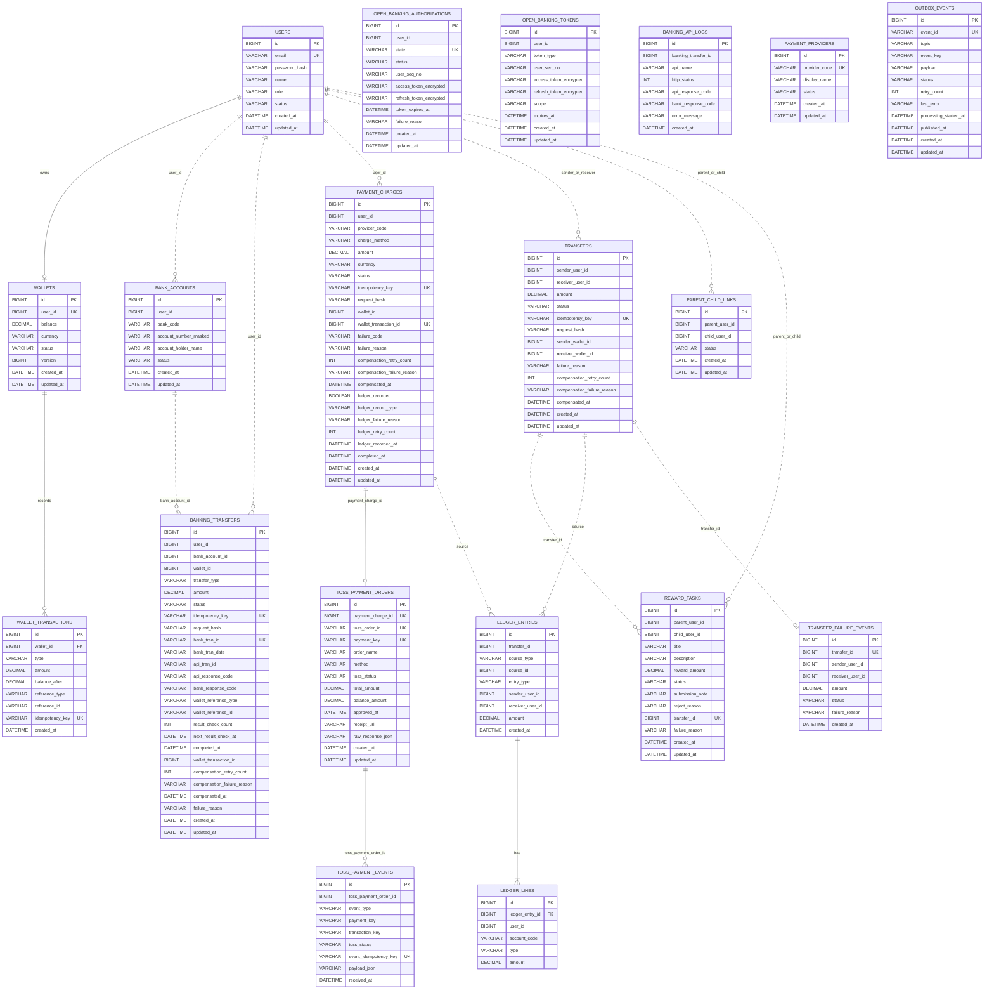

# PayFlow ERD

PayFlow에서 실제로 구현된 데이터 모델을 정리한다.

목표 흐름: 회원 가입 → 지갑 생성 → 계좌 연결 → 지갑 충전(Toss PG / 오픈뱅킹) → 사용자 간 송금 → 미션 보상 지급 → 원장 기록

## 설계 원칙

- 서비스별로 DB를 분리한다.
- 다른 서비스의 DB를 직접 조인하지 않고 참조 ID만 저장한다.
- 멱등성은 거래 테이블의 `idempotency_key`, `request_hash`로 처리한다.
- 가족/가구 개념은 별도 aggregate 없이 `parent_child_links`로 표현한다.
- 원장은 `ledger_entries`, `ledger_lines`로 복식부기 형태를 유지한다.

## Databases

```text
payflow_user
payflow_wallet
payflow_banking
payflow_transfer
payflow_reward
payflow_ledger
```

## ERD (핵심 흐름)



## Table Summary

| DB | Table | 책임 |
| --- | --- | --- |
| payflow_user | users | 사용자 인증 정보, 역할, 상태 |
| payflow_wallet | wallets | 사용자별 지갑 잔액 |
| payflow_wallet | wallet_transactions | 지갑 잔액 변경 이력 |
| payflow_banking | bank_accounts | 연결 은행 계좌 |
| payflow_banking | banking_transfers | 오픈뱅킹 충전/출금 요청 상태 관리 |
| payflow_banking | open_banking_authorizations | 오픈뱅킹 OAuth 인가 요청 상태 |
| payflow_banking | open_banking_tokens | 오픈뱅킹 액세스/리프레시 토큰 (암호화) |
| payflow_banking | banking_api_logs | 오픈뱅킹 API 호출 로그 |
| payflow_banking | payment_charges | Toss PG 충전 요청 상태 관리 |
| payflow_banking | toss_payment_orders | Toss 주문 및 결제 결과 |
| payflow_banking | toss_payment_events | Toss 웹훅 이벤트 수신 기록 |
| payflow_banking | payment_providers | 결제 수단 제공자 설정 |
| payflow_transfer | transfers | 사용자 간 송금 요청과 결과 |
| payflow_transfer | outbox_events | Kafka 발행을 위한 Transactional Outbox |
| payflow_reward | parent_child_links | 부모-자녀 연결 관계 |
| payflow_reward | reward_tasks | 미션 상태와 보상 지급 결과 |
| payflow_ledger | ledger_entries | 원장 전표 header |
| payflow_ledger | ledger_lines | 원장 전표 line |
| payflow_ledger | transfer_failure_events | 송금 실패 이벤트 추적 |

---

## payflow_user

### users

| Column | Type | Constraint | Description |
| --- | --- | --- | --- |
| id | BIGINT | PK | 사용자 ID |
| email | VARCHAR(255) | UNIQUE, NOT NULL | 로그인 email |
| password_hash | VARCHAR(255) | NOT NULL | 해시된 비밀번호 |
| name | VARCHAR(100) | NOT NULL | 사용자 이름 |
| role | VARCHAR(30) | NOT NULL | `PARENT`, `CHILD` |
| status | VARCHAR(30) | NOT NULL | `ACTIVE`, `LOCKED`, `WITHDRAWN` |
| created_at | DATETIME | NOT NULL | 생성 시각 |
| updated_at | DATETIME | NOT NULL | 수정 시각 |

---

## payflow_wallet

### wallets

| Column | Type | Constraint | Description |
| --- | --- | --- | --- |
| id | BIGINT | PK | 지갑 ID |
| user_id | BIGINT | UNIQUE, NOT NULL | 사용자 ID |
| balance | DECIMAL(19,0) | NOT NULL | 현재 잔액 |
| currency | VARCHAR(3) | NOT NULL | `KRW` |
| status | VARCHAR(30) | NOT NULL | `ACTIVE`, `LOCKED`, `CLOSED` |
| version | BIGINT | NOT NULL | 낙관적 락 버전 |
| created_at | DATETIME | NOT NULL | 생성 시각 |
| updated_at | DATETIME | NOT NULL | 수정 시각 |

### wallet_transactions

| Column | Type | Constraint | Description |
| --- | --- | --- | --- |
| id | BIGINT | PK | 지갑 거래 ID |
| wallet_id | BIGINT | FK, NOT NULL | 지갑 ID |
| type | VARCHAR(30) | NOT NULL | `CREDIT`, `DEBIT` |
| amount | DECIMAL(19,0) | NOT NULL | 변경 금액 |
| balance_after | DECIMAL(19,0) | NOT NULL | 변경 후 잔액 |
| reference_type | VARCHAR(50) | NOT NULL | `BANKING_DEPOSIT`, `TRANSFER_DEBIT`, `TRANSFER_CREDIT`, `REWARD_PAYMENT`, `TRANSFER_COMPENSATION` |
| reference_id | VARCHAR(100) | NOT NULL | 원천 거래 ID |
| idempotency_key | VARCHAR(255) | UNIQUE | 지갑 반영 중복 방지 키 |
| created_at | DATETIME | NOT NULL | 생성 시각 |

---

## payflow_banking

### bank_accounts

| Column | Type | Constraint | Description |
| --- | --- | --- | --- |
| id | BIGINT | PK | 계좌 ID |
| user_id | BIGINT | NOT NULL | 사용자 ID |
| bank_code | VARCHAR(10) | NOT NULL | 은행 코드 |
| account_number_masked | VARCHAR(50) | NOT NULL | 마스킹된 계좌번호 |
| account_holder_name | VARCHAR(100) | NOT NULL | 예금주명 |
| status | VARCHAR(30) | NOT NULL | `ACTIVE`, `LOCKED`, `DELETED` |
| created_at | DATETIME | NOT NULL | 생성 시각 |
| updated_at | DATETIME | NOT NULL | 수정 시각 |

### banking_transfers

오픈뱅킹 충전(`CHARGE`)과 출금(`WITHDRAWAL`) 요청을 관리한다. 오픈뱅킹 API 응답이 즉시 오지 않는 경우 `BANK_PROCESSING` 상태로 두고 스케줄러가 결과를 재조회한다.

| Column | Type | Constraint | Description |
| --- | --- | --- | --- |
| id | BIGINT | PK | 거래 ID |
| user_id | BIGINT | NOT NULL | 사용자 ID |
| bank_account_id | BIGINT | NOT NULL | 연결 계좌 ID |
| wallet_id | BIGINT |  | 반영된 지갑 ID |
| transfer_type | VARCHAR(20) | NOT NULL | `CHARGE`, `WITHDRAWAL` |
| amount | DECIMAL(19,0) | NOT NULL | 금액 |
| status | VARCHAR(30) | NOT NULL | 아래 상태값 참조 |
| idempotency_key | VARCHAR(120) | UNIQUE, NOT NULL | 멱등키 |
| request_hash | VARCHAR(64) | NOT NULL | 요청 본문 hash |
| bank_tran_id | VARCHAR(80) | UNIQUE, NOT NULL | 오픈뱅킹 거래고유번호 |
| bank_tran_date | VARCHAR(8) |  | 은행 거래일자 |
| tran_dtime | VARCHAR(14) |  | 거래 일시 |
| api_tran_id | VARCHAR(80) |  | 오픈뱅킹 API 거래 ID |
| api_response_code | VARCHAR(20) |  | 오픈뱅킹 응답 코드 |
| bank_response_code | VARCHAR(20) |  | 은행 응답 코드 |
| wallet_reference_type | VARCHAR(50) |  | 지갑 반영 reference_type |
| wallet_reference_id | VARCHAR(100) |  | 지갑 반영 reference_id |
| result_check_count | INT | NOT NULL | 결과 재조회 횟수 |
| next_result_check_at | DATETIME |  | 다음 결과 조회 예정 시각 |
| last_result_checked_at | DATETIME |  | 마지막 결과 조회 시각 |
| completed_at | DATETIME |  | 완료 시각 |
| wallet_transaction_id | BIGINT |  | 지갑 거래 ID |
| compensation_retry_count | INT | NOT NULL | 보상 재시도 횟수 |
| compensation_failure_reason | VARCHAR(500) |  | 보상 실패 사유 |
| compensated_at | DATETIME |  | 보상 완료 시각 |
| failure_reason | VARCHAR(500) |  | 실패 사유 |
| created_at | DATETIME | NOT NULL | 생성 시각 |
| updated_at | DATETIME | NOT NULL | 수정 시각 |

### open_banking_authorizations

오픈뱅킹 OAuth 인가 요청 세션을 관리한다. `state` 값으로 callback과 매핑한다.

| Column | Type | Constraint | Description |
| --- | --- | --- | --- |
| id | BIGINT | PK | 인가 ID |
| user_id | BIGINT | NOT NULL | 사용자 ID |
| state | VARCHAR(255) | UNIQUE, NOT NULL | OAuth state 값 |
| status | VARCHAR(30) | NOT NULL | `PENDING`, `COMPLETED`, `FAILED` |
| user_seq_no | VARCHAR(50) |  | 오픈뱅킹 사용자 일련번호 |
| access_token_encrypted | VARCHAR(2000) |  | 암호화된 액세스 토큰 |
| refresh_token_encrypted | VARCHAR(2000) |  | 암호화된 리프레시 토큰 |
| token_expires_at | DATETIME |  | 토큰 만료 시각 |
| failure_reason | VARCHAR(500) |  | 실패 사유 |
| created_at | DATETIME | NOT NULL | 생성 시각 |
| updated_at | DATETIME | NOT NULL | 수정 시각 |

### open_banking_tokens

사용자별 오픈뱅킹 토큰을 암호화하여 보관한다. `(user_id, token_type)` 조합으로 유일하다.

| Column | Type | Constraint | Description |
| --- | --- | --- | --- |
| id | BIGINT | PK | 토큰 ID |
| user_id | BIGINT |  | 사용자 ID |
| token_type | VARCHAR(20) | NOT NULL | `ACCESS`, `REFRESH` |
| user_seq_no | VARCHAR(30) |  | 오픈뱅킹 사용자 일련번호 |
| client_use_code | VARCHAR(20) |  | 클라이언트 이용 코드 |
| access_token_encrypted | VARCHAR(2000) | NOT NULL | 암호화된 액세스 토큰 |
| refresh_token_encrypted | VARCHAR(2000) |  | 암호화된 리프레시 토큰 |
| scope | VARCHAR(100) |  | 토큰 scope |
| expires_at | DATETIME |  | 만료 시각 |
| created_at | DATETIME | NOT NULL | 생성 시각 |
| updated_at | DATETIME | NOT NULL | 수정 시각 |

### banking_api_logs

오픈뱅킹 API 호출 결과를 모두 기록한다. 장애 분석과 결과 재조회에 사용한다.

| Column | Type | Constraint | Description |
| --- | --- | --- | --- |
| id | BIGINT | PK | 로그 ID |
| banking_transfer_id | BIGINT |  | 연결된 거래 ID |
| api_name | VARCHAR(50) | NOT NULL | API 이름 |
| request_id | VARCHAR(100) |  | 요청 ID |
| http_status | INT |  | HTTP 상태 코드 |
| api_response_code | VARCHAR(20) |  | 오픈뱅킹 응답 코드 |
| api_tran_id | VARCHAR(80) |  | API 거래 ID |
| bank_response_code | VARCHAR(20) |  | 은행 응답 코드 |
| request_keys | VARCHAR(1000) |  | 요청 주요 필드 요약 |
| response_keys | VARCHAR(1000) |  | 응답 주요 필드 요약 |
| error_message | VARCHAR(500) |  | 에러 메시지 |
| created_at | DATETIME | NOT NULL | 생성 시각 |

### payment_charges

Toss PG 충전 요청 상태를 관리한다. 지갑 반영 실패와 원장 기록 실패 각각에 대한 보상 retry 메타데이터를 포함한다.

| Column | Type | Constraint | Description |
| --- | --- | --- | --- |
| id | BIGINT | PK | 충전 ID |
| user_id | BIGINT | NOT NULL | 사용자 ID |
| provider_code | VARCHAR(30) | NOT NULL | `TOSS_PAYMENTS` |
| charge_method | VARCHAR(30) | NOT NULL | `TOSS_WIDGET` |
| amount | DECIMAL(19,0) | NOT NULL | 충전 금액 |
| currency | VARCHAR(3) | NOT NULL | `KRW` |
| status | VARCHAR(40) | NOT NULL | 아래 상태값 참조 |
| idempotency_key | VARCHAR(255) | UNIQUE, NOT NULL | 멱등키 |
| request_hash | VARCHAR(64) | NOT NULL | 요청 본문 hash |
| wallet_id | BIGINT |  | 반영된 지갑 ID |
| wallet_transaction_id | BIGINT | UNIQUE | 지갑 거래 ID |
| failure_code | VARCHAR(100) |  | 실패 코드 |
| failure_reason | VARCHAR(500) |  | 실패 사유 |
| compensation_retry_count | INT | NOT NULL | 지갑 재입금 재시도 횟수 |
| compensation_failure_reason | VARCHAR(500) |  | 재입금 실패 사유 |
| compensated_at | DATETIME |  | 지갑 재입금 완료 시각 |
| ledger_recorded | BOOLEAN | NOT NULL | 원장 기록 완료 여부 |
| ledger_record_type | VARCHAR(40) |  | `TOSS_CHARGE`, `TOSS_CANCEL` |
| ledger_failure_reason | VARCHAR(500) |  | 원장 기록 실패 사유 |
| ledger_retry_count | INT | NOT NULL | 원장 재기록 재시도 횟수 |
| ledger_recorded_at | DATETIME |  | 원장 기록 완료 시각 |
| completed_at | DATETIME |  | 충전 완료 시각 |
| created_at | DATETIME | NOT NULL | 생성 시각 |
| updated_at | DATETIME | NOT NULL | 수정 시각 |

### toss_payment_orders

Toss 주문 정보와 결제 결과를 보관한다. `payment_charges`와 1:1 관계다.

| Column | Type | Constraint | Description |
| --- | --- | --- | --- |
| id | BIGINT | PK | 주문 ID |
| payment_charge_id | BIGINT | UNIQUE, NOT NULL | 충전 ID |
| toss_order_id | VARCHAR(64) | UNIQUE, NOT NULL | Toss 주문 ID |
| payment_key | VARCHAR(200) | UNIQUE | Toss 결제 키 |
| order_name | VARCHAR(100) | NOT NULL | 주문명 |
| method | VARCHAR(50) |  | 결제 수단 |
| toss_status | VARCHAR(40) | NOT NULL | Toss 결제 상태 |
| total_amount | DECIMAL(19,0) | NOT NULL | 총 금액 |
| balance_amount | DECIMAL(19,0) |  | 잔여 금액 (취소 후 남은 금액) |
| approved_at | DATETIME |  | 승인 시각 |
| receipt_url | VARCHAR(500) |  | 영수증 URL |
| checkout_url | VARCHAR(500) |  | 결제 페이지 URL |
| raw_response_json | VARCHAR(4000) |  | Toss 응답 원문 |
| created_at | DATETIME | NOT NULL | 생성 시각 |
| updated_at | DATETIME | NOT NULL | 수정 시각 |

### toss_payment_events

Toss 웹훅을 수신한 기록을 보관한다. `event_idempotency_key`로 중복 처리를 방지한다.

| Column | Type | Constraint | Description |
| --- | --- | --- | --- |
| id | BIGINT | PK | 이벤트 ID |
| toss_payment_order_id | BIGINT | NOT NULL | 주문 ID |
| event_type | VARCHAR(50) | NOT NULL | 이벤트 유형 |
| payment_key | VARCHAR(200) |  | Toss 결제 키 |
| transaction_key | VARCHAR(64) |  | Toss 거래 키 |
| toss_status | VARCHAR(40) |  | Toss 결제 상태 |
| event_idempotency_key | VARCHAR(255) | UNIQUE | 웹훅 중복 처리 방지 키 |
| payload_json | VARCHAR(4000) | NOT NULL | 웹훅 payload 원문 |
| received_at | DATETIME | NOT NULL | 수신 시각 |

### payment_providers

결제 수단 제공자 설정을 관리한다.

| Column | Type | Constraint | Description |
| --- | --- | --- | --- |
| id | BIGINT | PK | 제공자 ID |
| provider_code | VARCHAR(30) | UNIQUE, NOT NULL | 제공자 코드 (`TOSS_PAYMENTS`) |
| display_name | VARCHAR(100) | NOT NULL | 표시 이름 |
| status | VARCHAR(30) | NOT NULL | `ACTIVE`, `DISABLED` |
| created_at | DATETIME | NOT NULL | 생성 시각 |
| updated_at | DATETIME | NOT NULL | 수정 시각 |

---

## payflow_transfer

### transfers

| Column | Type | Constraint | Description |
| --- | --- | --- | --- |
| id | BIGINT | PK | 송금 ID |
| sender_user_id | BIGINT | NOT NULL | 송금자 사용자 ID |
| receiver_user_id | BIGINT | NOT NULL | 수신자 사용자 ID |
| amount | DECIMAL(19,0) | NOT NULL | 송금 금액 |
| status | VARCHAR(30) | NOT NULL | `REQUESTED`, `PROCESSING`, `SUCCEEDED`, `FAILED`, `COMPENSATION_REQUIRED`, `COMPENSATED` |
| idempotency_key | VARCHAR(120) | UNIQUE, NOT NULL | 송금 요청 멱등키 |
| request_hash | VARCHAR(64) | NOT NULL | 요청 본문 hash |
| sender_wallet_id | BIGINT |  | 송금자 지갑 ID (debit 완료 후 기록) |
| receiver_wallet_id | BIGINT |  | 수신자 지갑 ID (credit 완료 후 기록) |
| failure_reason | VARCHAR(500) |  | 실패 사유 |
| compensation_retry_count | INT | NOT NULL | 보상 재시도 횟수 |
| compensation_failure_reason | VARCHAR(500) |  | 보상 실패 사유 |
| compensated_at | DATETIME |  | 보상 완료 시각 |
| created_at | DATETIME | NOT NULL | 생성 시각 |
| updated_at | DATETIME | NOT NULL | 수정 시각 |

### outbox_events

송금 완료/실패 이벤트를 Kafka로 발행하기 위한 Transactional Outbox 테이블이다. Relay가 주기적으로 PENDING 이벤트를 폴링해 Kafka로 발행하며, 발행 성공 시 PUBLISHED, 실패 시 FAILED로 전환된다.

| Column | Type | Constraint | Description |
| --- | --- | --- | --- |
| id | BIGINT | PK | ID |
| event_id | VARCHAR(36) | UNIQUE, NOT NULL | 이벤트 UUID |
| topic | VARCHAR(120) | NOT NULL | Kafka 토픽 |
| event_key | VARCHAR(120) | NOT NULL | Kafka 메시지 키 |
| payload | TEXT | NOT NULL | 이벤트 payload JSON |
| status | VARCHAR(20) | NOT NULL | `PENDING`, `PROCESSING`, `PUBLISHED`, `FAILED` |
| retry_count | INT | NOT NULL | 재시도 횟수 |
| last_error | VARCHAR(500) |  | 마지막 에러 메시지 |
| processing_started_at | DATETIME |  | 처리 시작 시각 |
| published_at | DATETIME |  | Kafka 발행 완료 시각 |
| created_at | DATETIME | NOT NULL | 생성 시각 |
| updated_at | DATETIME | NOT NULL | 수정 시각 |

---

## payflow_reward

### parent_child_links

| Column | Type | Constraint | Description |
| --- | --- | --- | --- |
| id | BIGINT | PK | 연결 ID |
| parent_user_id | BIGINT | NOT NULL | 부모 사용자 ID |
| child_user_id | BIGINT | NOT NULL | 자녀 사용자 ID |
| status | VARCHAR(30) | NOT NULL | `ACTIVE`, `INACTIVE` |
| created_at | DATETIME | NOT NULL | 생성 시각 |
| updated_at | DATETIME | NOT NULL | 수정 시각 |

### reward_tasks

| Column | Type | Constraint | Description |
| --- | --- | --- | --- |
| id | BIGINT | PK | 미션 ID |
| parent_user_id | BIGINT | NOT NULL | 부모 사용자 ID |
| child_user_id | BIGINT | NOT NULL | 자녀 사용자 ID |
| title | VARCHAR(120) | NOT NULL | 미션 제목 |
| description | VARCHAR(1000) |  | 미션 설명 |
| reward_amount | DECIMAL(19,0) | NOT NULL | 보상 금액 |
| status | VARCHAR(20) | NOT NULL | `CREATED`, `SUBMITTED`, `APPROVED`, `PAID`, `REJECTED`, `CANCELED` |
| submission_note | VARCHAR(1000) |  | 자녀 제출 메모 |
| reject_reason | VARCHAR(500) |  | 부모 반려 사유 |
| transfer_id | BIGINT | UNIQUE | 보상 지급 송금 ID |
| failure_reason | VARCHAR(500) |  | 보상 지급 실패 사유 |
| created_at | DATETIME | NOT NULL | 생성 시각 |
| updated_at | DATETIME | NOT NULL | 수정 시각 |

---

## payflow_ledger

### ledger_entries

| Column | Type | Constraint | Description |
| --- | --- | --- | --- |
| id | BIGINT | PK | 전표 ID |
| transfer_id | BIGINT |  | 연결 송금 ID (TRANSFER 유형인 경우) |
| source_type | VARCHAR(40) | NOT NULL | `TRANSFER`, `TOSS_CHARGE`, `TOSS_CANCEL`, `OPEN_BANKING_CHARGE` |
| source_id | BIGINT | NOT NULL | 원천 거래 ID |
| entry_type | VARCHAR(40) | NOT NULL | `TRANSFER`, `USER_WALLET_TOPUP`, `PG_CANCEL` |
| sender_user_id | BIGINT |  | 송금자 사용자 ID |
| receiver_user_id | BIGINT |  | 수신자 사용자 ID |
| amount | DECIMAL(19,0) | NOT NULL | 금액 |
| created_at | DATETIME | NOT NULL | 생성 시각 |

### ledger_lines

| Column | Type | Constraint | Description |
| --- | --- | --- | --- |
| id | BIGINT | PK | 전표 라인 ID |
| ledger_entry_id | BIGINT | FK, NOT NULL | 전표 ID |
| user_id | BIGINT |  | 사용자 ID |
| account_code | VARCHAR(50) | NOT NULL | `USER_WALLET_OUT`, `USER_WALLET_IN`, `PG_CASH` |
| type | VARCHAR(20) | NOT NULL | `DEBIT`, `CREDIT` |
| amount | DECIMAL(19,0) | NOT NULL | 금액 |

### transfer_failure_events

`transfer.failed` Kafka 이벤트를 소비해 저장하는 실패 추적 테이블이다.

| Column | Type | Constraint | Description |
| --- | --- | --- | --- |
| id | BIGINT | PK | ID |
| transfer_id | BIGINT | UNIQUE, NOT NULL | 송금 ID |
| sender_user_id | BIGINT | NOT NULL | 송금자 사용자 ID |
| receiver_user_id | BIGINT | NOT NULL | 수신자 사용자 ID |
| amount | DECIMAL(19,0) | NOT NULL | 금액 |
| status | VARCHAR(40) | NOT NULL | 송금 상태 |
| failure_reason | VARCHAR(500) |  | 실패 사유 |
| created_at | DATETIME | NOT NULL | 생성 시각 |

---

## 주요 제약

| Table | Constraint | Purpose |
| --- | --- | --- |
| users | UNIQUE(email) | 계정 중복 방지 |
| wallets | UNIQUE(user_id) | 사용자당 지갑 1개 |
| wallet_transactions | UNIQUE(idempotency_key) | 지갑 반영 중복 방지 |
| bank_accounts | UNIQUE(user_id, bank_code, account_number_masked) | 같은 계좌 중복 등록 방지 |
| banking_transfers | UNIQUE(idempotency_key) | 오픈뱅킹 요청 멱등성 |
| banking_transfers | UNIQUE(bank_tran_id) | 오픈뱅킹 거래번호 중복 방지 |
| open_banking_authorizations | UNIQUE(state) | OAuth state 충돌 방지 |
| open_banking_tokens | UNIQUE(user_id, token_type) | 사용자별 토큰 유형 1개 |
| payment_charges | UNIQUE(idempotency_key) | Toss 충전 요청 멱등성 |
| payment_charges | UNIQUE(wallet_transaction_id) | 지갑 반영 중복 방지 |
| toss_payment_orders | UNIQUE(payment_charge_id) | 충전 1건당 주문 1개 |
| toss_payment_orders | UNIQUE(toss_order_id) | Toss 주문 ID 중복 방지 |
| toss_payment_orders | UNIQUE(payment_key) | Toss 결제 키 중복 방지 |
| toss_payment_events | UNIQUE(event_idempotency_key) | 웹훅 중복 처리 방지 |
| transfers | UNIQUE(idempotency_key) | 송금 요청 멱등성 |
| outbox_events | UNIQUE(event_id) | Outbox 이벤트 중복 방지 |
| parent_child_links | UNIQUE(parent_user_id, child_user_id) | 같은 부모-자녀 연결 중복 방지 |
| reward_tasks | UNIQUE(transfer_id) | 미션 보상 중복 지급 방지 |
| ledger_entries | UNIQUE(source_type, source_id) | 같은 원천 거래의 원장 중복 기록 방지 |
| transfer_failure_events | UNIQUE(transfer_id) | 실패 이벤트 중복 저장 방지 |

---

## 상태값

| Enum | Values |
| --- | --- |
| UserRole | `PARENT`, `CHILD` |
| UserStatus | `ACTIVE`, `LOCKED`, `WITHDRAWN` |
| WalletStatus | `ACTIVE`, `LOCKED`, `CLOSED` |
| WalletTransactionType | `CREDIT`, `DEBIT` |
| WalletReferenceType | `BANKING_DEPOSIT`, `TRANSFER_DEBIT`, `TRANSFER_CREDIT`, `REWARD_PAYMENT`, `TRANSFER_COMPENSATION` |
| BankAccountStatus | `ACTIVE`, `LOCKED`, `DELETED` |
| BankingTransferType | `CHARGE`, `WITHDRAWAL` |
| BankingTransferStatus | `REQUESTED` → `WALLET_WITHDRAWING` / `BANK_PROCESSING` → `BANK_SUCCEEDED` → `WALLET_REFLECTING` → `COMPLETED` / `FAILED` / `COMPENSATION_REQUIRED` → `COMPENSATED` |
| PaymentChargeStatus | `READY` → `PAYMENT_APPROVED` → `WALLET_REFLECTING` → `COMPLETED` / `FAILED` / `CANCELED` / `COMPENSATION_REQUIRED` |
| TossPaymentStatus | `READY`, `IN_PROGRESS`, `WAITING_FOR_DEPOSIT`, `DONE`, `CANCELED`, `PARTIAL_CANCELED`, `ABORTED`, `EXPIRED` |
| TransferStatus | `REQUESTED` → `PROCESSING` → `SUCCEEDED` / `FAILED` / `COMPENSATION_REQUIRED` → `COMPENSATED` |
| OutboxEventStatus | `PENDING`, `PROCESSING`, `PUBLISHED`, `FAILED` |
| ParentChildLinkStatus | `ACTIVE`, `INACTIVE` |
| RewardTaskStatus | `CREATED`, `SUBMITTED`, `APPROVED`, `PAID`, `REJECTED`, `CANCELED` |
| LedgerSourceType | `TRANSFER`, `TOSS_CHARGE`, `TOSS_CANCEL`, `OPEN_BANKING_CHARGE` |
| LedgerEntryType | `TRANSFER`, `USER_WALLET_TOPUP`, `PG_CANCEL` |
| LedgerLineType | `DEBIT`, `CREDIT` |

---

## 구현 주의사항

- 서비스 간 DB foreign key는 만들지 않는다.
- 같은 DB 안의 관계만 FK로 묶는다. 예: `wallet_transactions.wallet_id`, `ledger_lines.ledger_entry_id`.
- 금액은 모두 `DECIMAL(19,0)`을 사용한다.
- 계좌번호 원문과 비밀번호 원문은 저장하지 않는다.
- 오픈뱅킹 토큰은 반드시 암호화해서 저장한다.
- 지갑 잔액 변경은 반드시 `wallet_transactions`와 함께 하나의 transaction으로 저장한다.
- 원장은 수정하지 않고, 정정이 필요하면 새 전표로 남긴다.
