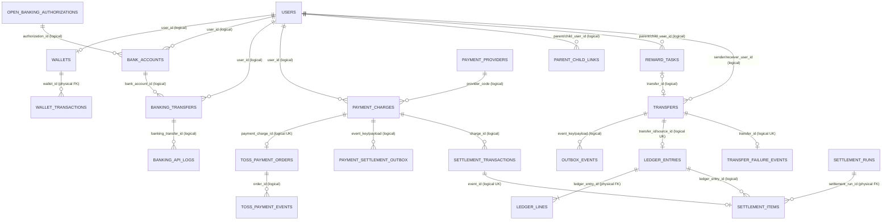
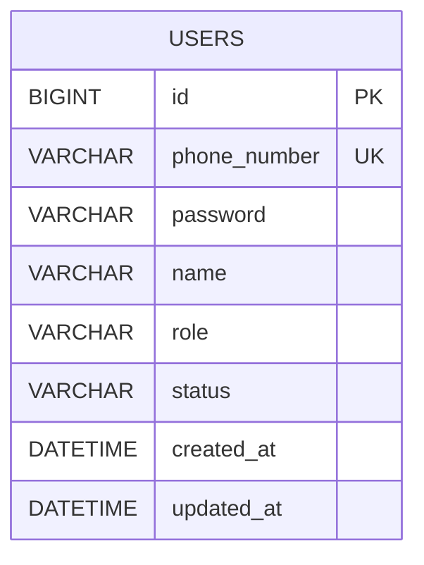
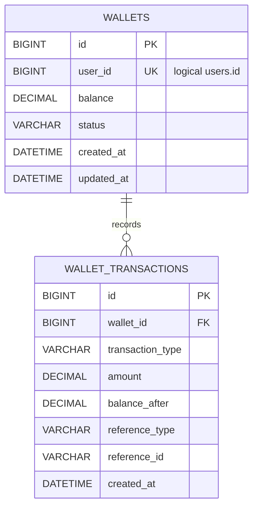
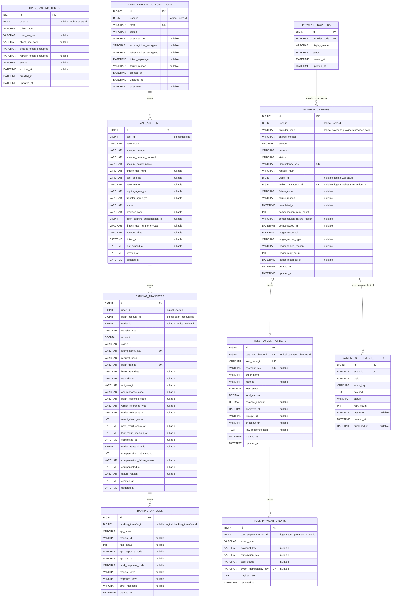
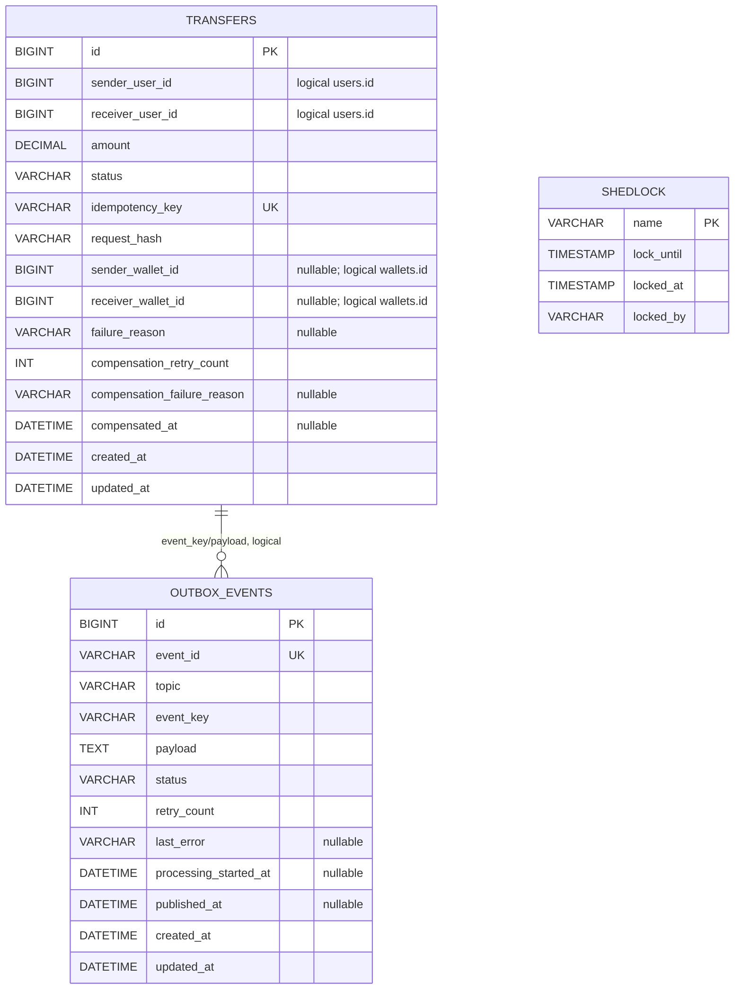
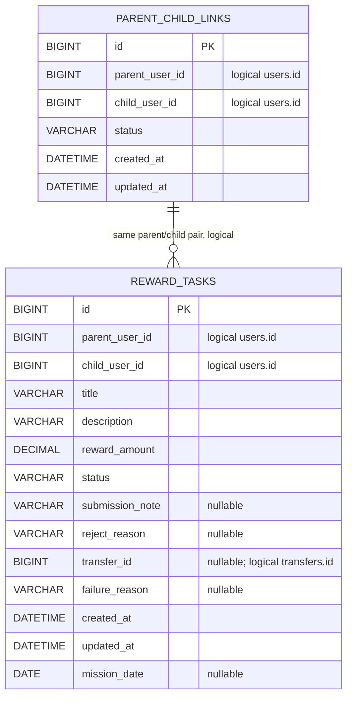
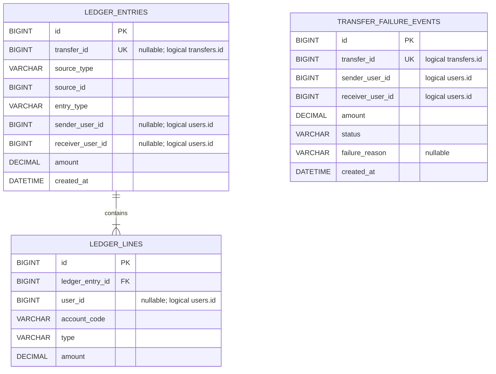
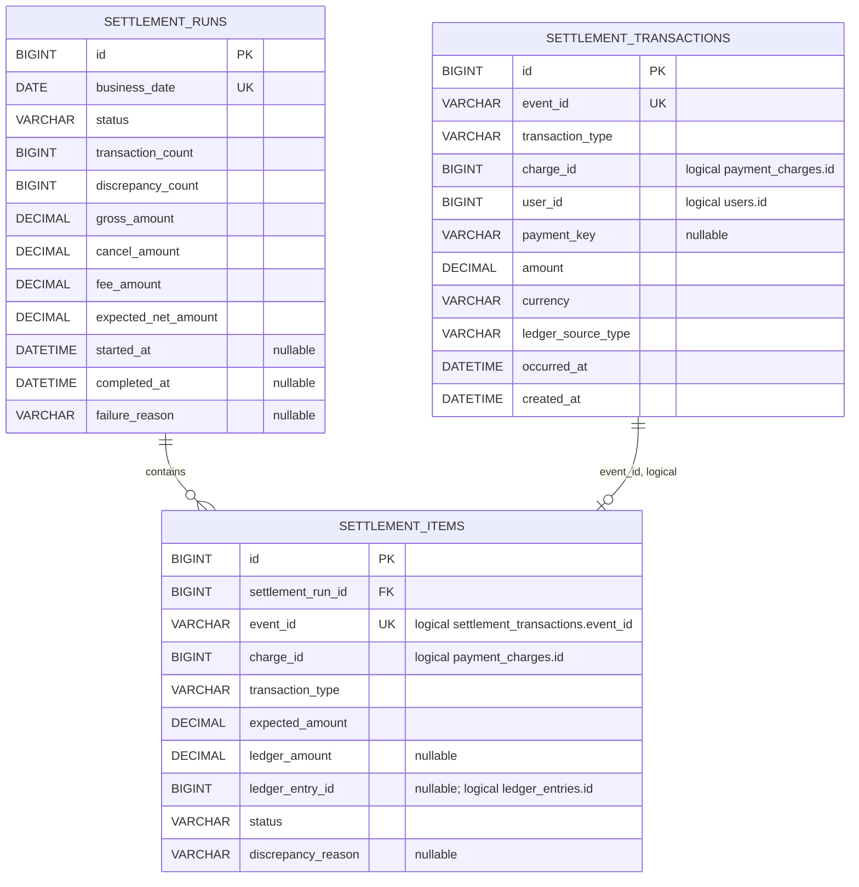
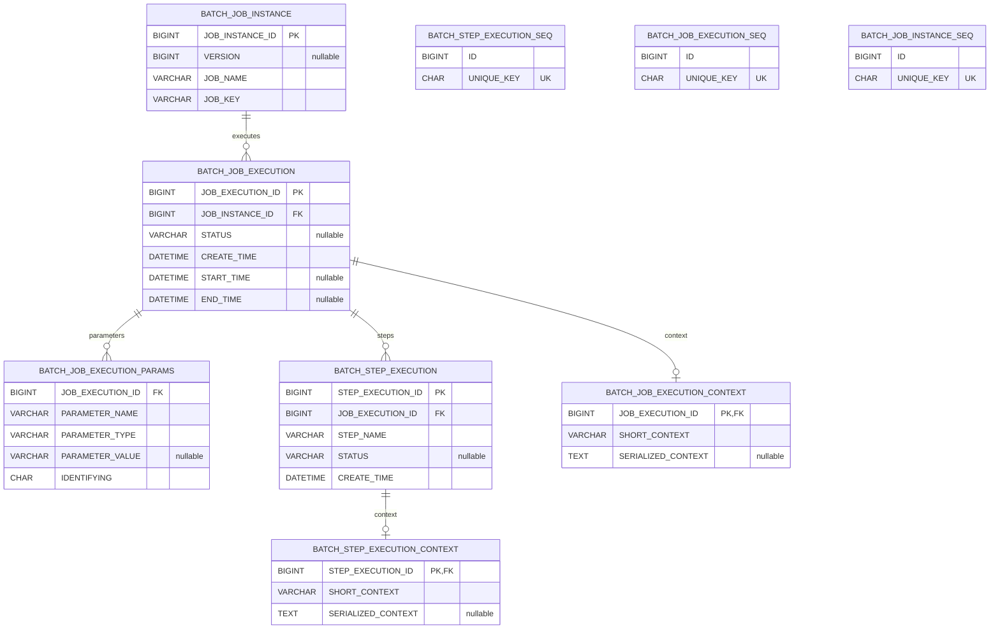

# PayFlow ERD

> 최종 점검일: 2026-07-06
> 기준: 7개 서비스의 JPA `@Entity` 24개, enum, Flyway 마이그레이션 전체

## 1. 문서 기준

- 컬럼명·자료형·PK·UK·물리 FK는 `src/main/resources/db/migration`의 최종 스키마를 기준으로 한다.
- 엔티티의 의미와 상태값은 JPA 엔티티 및 enum을 기준으로 한다.
- 각 서비스는 별도 데이터베이스를 소유한다. 따라서 다른 서비스의 ID를 저장하는 컬럼은 **논리 참조**이며 DB FK가 아니다.
- Mermaid의 `FK` 표시는 실제 마이그레이션에 선언된 물리 FK에만 사용한다.
- `nullable` 설명이 없는 컬럼은 `NOT NULL`이다. `"nullable"` 설명은 nullable 컬럼이다.
- Spring Batch 메타 테이블과 ShedLock 테이블은 도메인 테이블과 분리해 운영 테이블로 설명한다.
- `flyway_schema_history`는 Flyway가 관리하는 내부 테이블이므로 ERD 대상에서 제외한다.

## 2. 데이터베이스 및 엔티티 현황

| 서비스 | 데이터베이스 | 도메인/메시징 JPA 엔티티 | 운영 테이블 |
| --- | --- | ---: | ---: |
| user-service | `payflow_user` | 1 | 0 |
| wallet-service | `payflow_wallet` | 2 | 0 |
| banking-service | `payflow_banking` | 10 | 0 |
| transfer-service | `payflow_transfer` | 2 | 1 (`shedlock`) |
| reward-service | `payflow_reward` | 2 | 0 |
| ledger-service | `payflow_ledger` | 3 | 0 |
| settlement-service | `payflow_settlement` | 3 | 9 (`BATCH_*`) |
| **합계** | **7개 DB** | **23개 도메인/메시징 엔티티** | **10개 운영 테이블** |

`@Entity`는 운영 엔티티인 `ShedLock`을 포함해 총 24개다.

## 3. 전체 논리 관계

아래 다이어그램은 서비스 간 업무 참조를 보여준다. 선은 관계의 의미를 나타내며, 서비스 경계를 넘는 관계에는 물리 FK가 없다.

## 4. 서비스별 물리 ERD

### 4.1 user-service

| 테이블 | 주요 제약 및 인덱스 |
| --- | --- |
| `users` | `PK(id)`, `UK(phone_number)` |

### 4.2 wallet-service

| 테이블 | 주요 제약 및 인덱스 |
| --- | --- |
| `wallets` | `PK(id)`, `UK(user_id)` |
| `wallet_transactions` | `FK(wallet_id) -> wallets.id`, `UK(wallet_id, transaction_type, reference_type, reference_id)`, `IDX(wallet_id)` |

### 4.3 banking-service

banking-service에는 물리 FK가 하나도 없다. 아래 관계와 무결성은 애플리케이션에서 관리한다.

| 테이블 | 주요 제약 및 인덱스 |
| --- | --- |
| `bank_accounts` | `UK(user_id, bank_code, account_number)`, `IDX(user_id, status)`, `IDX(user_id, fintech_use_num)` |
| `banking_transfers` | `UK(idempotency_key)`, `UK(bank_tran_id)`, `IDX(user_id)`, `IDX(status, next_result_check_at)` |
| `banking_api_logs` | `IDX(banking_transfer_id)`, `IDX(request_id)` |
| `open_banking_tokens` | `UK(user_id, token_type)`, 동일 컬럼 조합 인덱스 |
| `open_banking_authorizations` | `UK(state)`, `IDX(user_id, status)` |
| `payment_providers` | `UK(provider_code)` |
| `payment_charges` | `UK(idempotency_key)`, `UK(wallet_transaction_id)`, `IDX(user_id, status)` |
| `toss_payment_orders` | `UK(payment_charge_id)`, `UK(toss_order_id)`, `UK(payment_key)` |
| `toss_payment_events` | `UK(event_idempotency_key)`, `IDX(toss_payment_order_id)` |
| `payment_settlement_outbox` | `UK(event_id)`, `IDX(status, created_at)` |

### 4.4 transfer-service

| 테이블 | 주요 제약 및 인덱스 |
| --- | --- |
| `transfers` | `UK(idempotency_key)`, `IDX(sender_user_id)`, `IDX(receiver_user_id)`, `IDX(status)` |
| `outbox_events` | `UK(event_id)`, `IDX(status)` |
| `shedlock` | `PK(name)`, 스케줄러 분산 락 운영 테이블 |

### 4.5 reward-service

| 테이블 | 주요 제약 및 인덱스 |
| --- | --- |
| `parent_child_links` | `UK(parent_user_id, child_user_id)`, `IDX(parent_user_id, status)`, `IDX(child_user_id, status)` |
| `reward_tasks` | `IDX(parent_user_id, status)`, `IDX(child_user_id, status)`; `transfer_id`에는 UK/FK 없음 |

### 4.6 ledger-service

| 테이블 | 주요 제약 및 인덱스 |
| --- | --- |
| `ledger_entries` | `UK(transfer_id)`, `UK(source_type, source_id)` |
| `ledger_lines` | `FK(ledger_entry_id) -> ledger_entries.id` |
| `transfer_failure_events` | `UK(transfer_id)` |

### 4.7 settlement-service

| 테이블 | 주요 제약 및 인덱스 |
| --- | --- |
| `settlement_transactions` | `UK(event_id)`, `IDX(occurred_at)` |
| `settlement_runs` | `UK(business_date)` |
| `settlement_items` | `FK(settlement_run_id) -> settlement_runs.id`, `UK(event_id)`, `IDX(settlement_run_id, status)` |

## 5. 운영 테이블

### 5.1 ShedLock

`shedlock`은 `transfer-service`의 `ShedLock` 엔티티와 JDBC ShedLock 공급자가 함께 사용하는 테이블이다. `name`이 락의 PK이며, 업무 데이터와 관계를 맺지 않는다.

### 5.2 Spring Batch 메타데이터

정산 배치 실행 이력은 아래 9개 테이블에 저장된다. 이들은 애플리케이션 JPA 엔티티가 아니라 Spring Batch가 직접 관리한다.

`BATCH_JOB_INSTANCE`에는 `UK(JOB_NAME, JOB_KEY)`가 있으며, 세 `*_SEQ` 테이블은 각각 `UK(UNIQUE_KEY)`를 가진다.

## 6. 상태 및 분류 값

| 구분 | 값 |
| --- | --- |
| 사용자 역할 | `PARENT`, `CHILD` |
| 사용자 상태 | `ACTIVE`, `LOCKED`, `WITHDRAWN` |
| 지갑 상태 | `ACTIVE`, `LOCKED`, `CLOSED` |
| 지갑 거래 유형 | `DEPOSIT`, `WITHDRAW` |
| 지갑 참조 유형 | `MANUAL_CHARGE`, `TRANSFER`, `OPEN_BANKING_CHARGE`, `OPEN_BANKING_WITHDRAWAL`, `OPEN_BANKING_REFUND`, `TOSS_PAYMENT_CHARGE`, `TOSS_PAYMENT_CANCEL` |
| 계좌 상태 | `ACTIVE`, `DELETED` |
| 오픈뱅킹 토큰 유형 | `ORG`, `USER` |
| 오픈뱅킹 인증 상태 | `REQUESTED`, `CONNECTED`, `FAILED`, `EXPIRED`, `REVOKED` |
| 뱅킹 이체 유형 | `CHARGE`, `WITHDRAWAL` |
| 뱅킹 이체 상태 | `REQUESTED`, `WALLET_WITHDRAWING`, `BANK_PROCESSING`, `BANK_SUCCEEDED`, `WALLET_REFLECTING`, `COMPLETED`, `SUCCEEDED`, `UNKNOWN`, `COMPENSATION_REQUIRED`, `COMPENSATED`, `FAILED` |
| 결제 제공자 상태 | `ACTIVE`, `DISABLED` |
| 결제 수단 | `TOSS_WIDGET`, `OPEN_BANKING_ACCOUNT` |
| 결제 충전 상태 | `READY`, `PAYMENT_PENDING`, `PAYMENT_APPROVED`, `WALLET_REFLECTING`, `COMPLETED`, `FAILED`, `CANCELED`, `PARTIAL_CANCELED`, `EXPIRED`, `UNKNOWN`, `COMPENSATION_REQUIRED` |
| Toss 결제 상태 | `READY`, `IN_PROGRESS`, `WAITING_FOR_DEPOSIT`, `DONE`, `CANCELED`, `PARTIAL_CANCELED`, `ABORTED`, `EXPIRED`, `UNKNOWN` |
| 송금 상태 | `REQUESTED`, `PROCESSING`, `SUCCEEDED`, `FAILED`, `COMPENSATION_REQUIRED`, `COMPENSATED` |
| Outbox 상태 | transfer: `PENDING`, `PROCESSING`, `PUBLISHED`, `FAILED`; settlement: `PENDING`, `PUBLISHED`, `FAILED` |
| 가족 연결 상태 | `ACTIVE`, `DELETED` |
| 미션 상태 | `CREATED`, `SUBMITTED`, `APPROVED`, `PAID`, `REJECTED`, `CANCELED` |
| 원장 source | `TRANSFER`, `TOSS_CHARGE`, `TOSS_CANCEL`, `OPEN_BANKING_CHARGE` |
| 원장 entry | `TRANSFER`, `USER_WALLET_TOPUP`, `PG_CANCEL` |
| 원장 line | `DEBIT`, `CREDIT` |
| 정산 거래 유형 | `CHARGE`, `CANCEL` |
| 정산 실행 상태 | `RUNNING`, `COMPLETED`, `WITH_DISCREPANCY`, `FAILED` |
| 대사 상태 | `MATCHED`, `MISSING_LEDGER`, `AMOUNT_MISMATCH` |

## 7. 핵심 무결성 규칙

1. 사용자 전화번호는 유일하며, 사용자당 지갑은 최대 하나다.
2. 지갑 잔액은 원 단위 `DECIMAL(19,0)`이며, 음수 잔액 방지는 `Wallet.withdraw()` 도메인 로직이 담당한다.
3. 지갑 거래는 `(wallet_id, transaction_type, reference_type, reference_id)`로 중복 반영을 방지한다.
4. 송금·뱅킹 이체·결제 충전은 각각 `idempotency_key`를 유일하게 저장하고 `request_hash`로 같은 키의 다른 요청을 식별한다.
5. 원장은 `(source_type, source_id)`를 유일하게 저장하며, 송금 원장은 `transfer_id`도 유일하다.
6. 원장 라인과 지갑 거래는 물리 FK로 부모 삭제/고아 데이터를 방지한다. 서비스 간 참조는 API·이벤트·보상 로직으로 일관성을 관리한다.
7. 결제 정산 이벤트는 발행 측 `payment_settlement_outbox.event_id`와 수신 측 `settlement_transactions.event_id`의 UK로 중복을 방지한다.
8. 일별 정산은 `settlement_runs.business_date` UK로 하루 한 실행 레코드만 유지하고, 각 이벤트는 `settlement_items.event_id` UK로 한 번만 대사한다.
9. 금액 컬럼은 모두 `DECIMAL(19,0)`, 통화 컬럼은 현재 `KRW`를 저장하는 `VARCHAR(3)`이다.
10. 원장 엔트리 한 건은 업무상 차변·대변 라인의 합이 같아야 하지만, 이 균형은 DB 제약이 아니라 도메인 생성 로직이 보장한다.

## 8. 점검 결과 및 주의사항

- 기존 ERD에 누락됐던 `banking_api_logs`, `open_banking_tokens`, `open_banking_authorizations`, `payment_providers`, `toss_payment_orders`, `toss_payment_events`, `transfer_failure_events`, `shedlock`을 반영했다.
- 기존 문서의 `wallets.currency`, `wallets.version`, `wallet_transactions.idempotency_key`는 실제 스키마에 없어 제거했다.
- `users.password_hash`는 실제 컬럼명인 `password`로 바로잡았다.
- `reward_tasks.paid_transfer_id`는 실제 컬럼명인 `transfer_id`로 바로잡았으며, 이 컬럼에는 현재 UK/FK가 없다.
- `ledger_entries.occurred_at`은 실제 스키마에 없어 제거하고 실제 헤더/라인 컬럼을 모두 반영했다.
- banking-service의 연관 ID는 같은 DB 안에 있어도 물리 FK가 없다. 삭제·정합성 검증을 DB가 강제하지 않는다는 점을 운영 시 고려해야 한다.
- `open_banking_tokens.user_id`, `toss_payment_orders.payment_key`, `toss_payment_events.event_idempotency_key`, `payment_charges.wallet_transaction_id`는 nullable UK다. MySQL에서는 `NULL`을 여러 건 허용한다.
- `reward_tasks.transfer_id`가 유일하지 않아 여러 미션이 같은 송금 ID를 참조할 수 있다. 업무 규칙상 1:1이 필요하면 별도 UK 마이그레이션이 필요하다.
- `settlement_items`는 JPA에서 `settlementRunId` 스칼라 필드로 매핑하지만, DB에는 `settlement_runs.id`를 향한 물리 FK가 존재한다.
- transfer-service V1과 V3가 모두 Outbox 처리 시각 컬럼을 다루지만 V3가 `ADD COLUMN IF NOT EXISTS`를 사용하므로 최종 스키마에는 중복 컬럼이 생기지 않는다.
