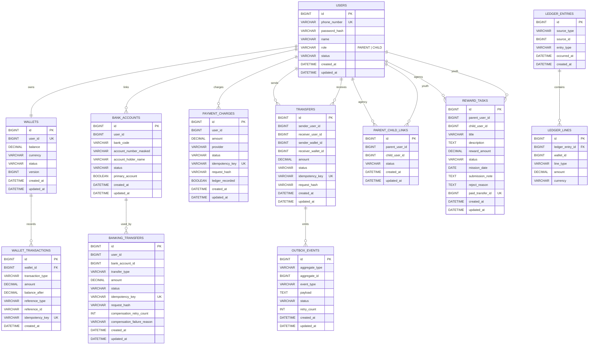

# PayFlow ERD

> 도메인 전환 안내: 현재 PayFlow는 **청년 정책 참여 미션 및 지원금 지급 플랫폼**으로 설명한다. 내부 구현 호환성을 위해 `PARENT`/`CHILD`, `/api/families`, `/api/missions`, `/api/cashbook`, `reward-service` 같은 명칭은 유지하지만, 문서와 발표에서는 각각 **기관 담당자**, **청년 참여자**, **참여자 연결**, **정책 미션**, **지원금 사용 내역**, **정책 미션/지원금 서비스**로 해석한다.

이 ERD는 실제 구현 테이블명을 기준으로 정리한다. 내부 테이블명은 기존 연결 도메인의 이름을 일부 유지하지만, 현재 서비스 의미는 기관 담당자와 청년 참여자 간 정책 미션 및 지원금 지급이다.

## Databases

```text
payflow_user
payflow_wallet
payflow_banking
payflow_transfer
payflow_reward
payflow_ledger
payflow_settlement
```

## Domain Mapping

| 구현 명칭 | 현재 서비스 의미 |
| --- | --- |
| `PARENT` | 기관 담당자 |
| `CHILD` | 청년 참여자 |
| `parent_child_links` | 기관-청년 참여자 연결 |
| `reward_tasks` | 정책 미션 |
| `reward_amount` | 정책 미션 지원금 금액 |
| `cashbook` | 청년 지원금 사용 내역 |
| `REWARD_PAYMENT` | 정책 미션 지원금 지급 |

## ERD



## Important Constraints

| 영역 | 제약 |
| --- | --- |
| 사용자 | 전화번호 unique, 역할은 `PARENT` 또는 `CHILD` |
| 지갑 | 사용자당 1개 지갑 |
| 지갑 거래 | `reference_type`, `reference_id`, `transaction_type` 조합으로 중복 반영 방지 |
| 정책 미션 | 승인 후 지급 완료 시 `paid_transfer_id` 저장 |
| 송금 | `idempotency_key`와 `request_hash`로 중복 송금 방지 |
| 원장 | `source_type`, `source_id` 기준 중복 원장 기록 방지 |

## Status Values

### Policy Mission

```text
CREATED -> SUBMITTED -> APPROVED -> PAID
                  |
                  -> REJECTED -> SUBMITTED
```

### Transfer

```text
REQUESTED -> PROCESSING -> SUCCEEDED
                         -> FAILED
                         -> COMPENSATION_REQUIRED -> COMPENSATED
```

### Banking Transfer

```text
REQUESTED -> BANK_PROCESSING -> COMPLETED
          -> FAILED
          -> COMPENSATION_REQUIRED -> COMPENSATED
```

## Design Notes

- 지갑 잔액의 단일 진실 공급자는 `wallet-service`다.
- 정책 미션 지원금 지급은 `reward-service`가 직접 잔액을 바꾸지 않고 `transfer-service`를 호출한다.
- `parent_child_links`, `reward_tasks`는 현재 정책 도메인에서도 재사용한다.
- 정산 확장은 `ledger_entries`, `ledger_lines`, 향후 `settlement-service`를 중심으로 진행한다.
