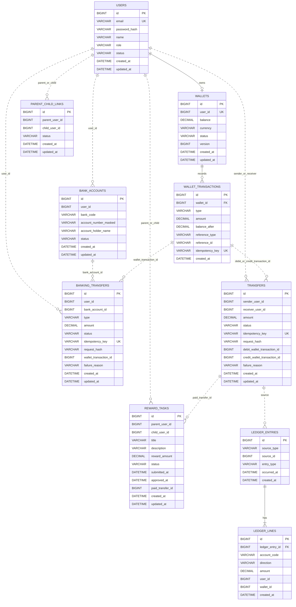

# PayFlow ERD

PayFlow MVP에서 실제로 구현할 데이터 모델만 정리한다.

목표는 "회원 가입 → 지갑 생성 → 계좌 연결 → 지갑 충전 → 사용자 간 송금 → 미션 보상 지급 → 원장 기록" 흐름을 설명할 수 있는 최소 ERD다.

## MVP 기준

- 서비스별로 DB를 분리한다.
- 다른 서비스의 DB를 직접 조인하지 않고 참조 ID만 저장한다.
- 멱등성은 별도 공통 테이블 없이 거래 테이블의 `idempotency_key`, `request_hash`로 처리한다.
- 가족/가구 개념은 별도 aggregate로 두지 않고 `parent_child_links`로 표현한다.
- 미션 제출 이력은 별도 테이블 없이 `reward_tasks` 상태 전이로 표현한다.
- 원장은 `ledger_entries`, `ledger_lines`로 복식부기 형태를 유지한다.

## Databases

```text
payflow_user
payflow_wallet
payflow_banking
payflow_transfer
payflow_reward
payflow_ledger
```

## ERD



## Table Summary

| DB | Table | 책임 |
| --- | --- | --- |
| payflow_user | users | 사용자 인증 정보, 역할, 상태 |
| payflow_wallet | wallets | 사용자별 지갑 잔액 |
| payflow_wallet | wallet_transactions | 지갑 잔액 변경 이력 |
| payflow_banking | bank_accounts | 연결 은행 계좌 |
| payflow_banking | banking_transfers | 은행 충전 요청과 지갑 반영 상태 |
| payflow_transfer | transfers | 사용자 간 송금 요청과 결과 |
| payflow_reward | parent_child_links | 부모-자녀 연결 관계 |
| payflow_reward | reward_tasks | 미션 상태와 보상 지급 결과 |
| payflow_ledger | ledger_entries | 원장 전표 header |
| payflow_ledger | ledger_lines | 원장 전표 line |

## payflow_user

### users

| Column | Type | Constraint | Description |
| --- | --- | --- | --- |
| id | BIGINT | PK | 사용자 ID |
| email | VARCHAR(255) | UNIQUE, NOT NULL | 로그인 email |
| password_hash | VARCHAR(255) | NOT NULL | 해시된 비밀번호 |
| name | VARCHAR(100) | NOT NULL | 사용자 이름 |
| role | VARCHAR(30) | NOT NULL | `PARENT`, `CHILD` |
| status | VARCHAR(30) | NOT NULL | `ACTIVE`, `LOCKED`, `WITHDRAWN` |
| created_at | DATETIME | NOT NULL | 생성 시각 |
| updated_at | DATETIME | NOT NULL | 수정 시각 |

## payflow_wallet

### wallets

| Column | Type | Constraint | Description |
| --- | --- | --- | --- |
| id | BIGINT | PK | 지갑 ID |
| user_id | BIGINT | UNIQUE, NOT NULL | 사용자 ID |
| balance | DECIMAL(19,0) | NOT NULL | 현재 잔액 |
| currency | VARCHAR(3) | NOT NULL | `KRW` |
| status | VARCHAR(30) | NOT NULL | `ACTIVE`, `LOCKED`, `CLOSED` |
| version | BIGINT | NOT NULL | 낙관적 락 버전 |
| created_at | DATETIME | NOT NULL | 생성 시각 |
| updated_at | DATETIME | NOT NULL | 수정 시각 |

### wallet_transactions

| Column | Type | Constraint | Description |
| --- | --- | --- | --- |
| id | BIGINT | PK | 지갑 거래 ID |
| wallet_id | BIGINT | FK, NOT NULL | 지갑 ID |
| type | VARCHAR(30) | NOT NULL | `CREDIT`, `DEBIT` |
| amount | DECIMAL(19,0) | NOT NULL | 변경 금액 |
| balance_after | DECIMAL(19,0) | NOT NULL | 변경 후 잔액 |
| reference_type | VARCHAR(50) | NOT NULL | `BANKING_DEPOSIT`, `TRANSFER_DEBIT`, `TRANSFER_CREDIT`, `REWARD_PAYMENT` |
| reference_id | VARCHAR(100) | NOT NULL | 원천 거래 ID |
| idempotency_key | VARCHAR(255) | UNIQUE | 지갑 반영 중복 방지 키 |
| created_at | DATETIME | NOT NULL | 생성 시각 |

## payflow_banking

### bank_accounts

| Column | Type | Constraint | Description |
| --- | --- | --- | --- |
| id | BIGINT | PK | 계좌 ID |
| user_id | BIGINT | NOT NULL | 사용자 ID |
| bank_code | VARCHAR(10) | NOT NULL | 은행 코드 |
| account_number_masked | VARCHAR(50) | NOT NULL | 마스킹된 계좌번호 |
| account_holder_name | VARCHAR(100) | NOT NULL | 예금주명 |
| status | VARCHAR(30) | NOT NULL | `ACTIVE`, `LOCKED`, `DELETED` |
| created_at | DATETIME | NOT NULL | 생성 시각 |
| updated_at | DATETIME | NOT NULL | 수정 시각 |

### banking_transfers

MVP에서는 충전만 구현한다. 은행 출금은 제외한다.

| Column | Type | Constraint | Description |
| --- | --- | --- | --- |
| id | BIGINT | PK | 은행 거래 ID |
| user_id | BIGINT | NOT NULL | 사용자 ID |
| bank_account_id | BIGINT | NOT NULL | 연결 계좌 ID |
| type | VARCHAR(30) | NOT NULL | `DEPOSIT` |
| amount | DECIMAL(19,0) | NOT NULL | 충전 금액 |
| status | VARCHAR(30) | NOT NULL | `REQUESTED`, `SUCCEEDED`, `FAILED` |
| idempotency_key | VARCHAR(255) | UNIQUE, NOT NULL | 충전 요청 멱등키 |
| request_hash | VARCHAR(255) | NOT NULL | 요청 본문 hash |
| wallet_transaction_id | BIGINT | UNIQUE | 지갑 입금 거래 ID |
| failure_reason | VARCHAR(500) |  | 실패 사유 |
| created_at | DATETIME | NOT NULL | 생성 시각 |
| updated_at | DATETIME | NOT NULL | 수정 시각 |

## payflow_transfer

### transfers

| Column | Type | Constraint | Description |
| --- | --- | --- | --- |
| id | BIGINT | PK | 송금 ID |
| sender_user_id | BIGINT | NOT NULL | 송금자 사용자 ID |
| receiver_user_id | BIGINT | NOT NULL | 수신자 사용자 ID |
| amount | DECIMAL(19,0) | NOT NULL | 송금 금액 |
| status | VARCHAR(30) | NOT NULL | `REQUESTED`, `PROCESSING`, `SUCCEEDED`, `FAILED` |
| idempotency_key | VARCHAR(255) | UNIQUE, NOT NULL | 송금 요청 멱등키 |
| request_hash | VARCHAR(255) | NOT NULL | 요청 본문 hash |
| debit_wallet_transaction_id | BIGINT | UNIQUE | 송금자 출금 거래 ID |
| credit_wallet_transaction_id | BIGINT | UNIQUE | 수신자 입금 거래 ID |
| failure_reason | VARCHAR(500) |  | 실패 사유 |
| created_at | DATETIME | NOT NULL | 생성 시각 |
| updated_at | DATETIME | NOT NULL | 수정 시각 |

## payflow_reward

### parent_child_links

| Column | Type | Constraint | Description |
| --- | --- | --- | --- |
| id | BIGINT | PK | 연결 ID |
| parent_user_id | BIGINT | NOT NULL | 부모 사용자 ID |
| child_user_id | BIGINT | NOT NULL | 자녀 사용자 ID |
| status | VARCHAR(30) | NOT NULL | `ACTIVE`, `INACTIVE` |
| created_at | DATETIME | NOT NULL | 생성 시각 |
| updated_at | DATETIME | NOT NULL | 수정 시각 |

### reward_tasks

| Column | Type | Constraint | Description |
| --- | --- | --- | --- |
| id | BIGINT | PK | 미션 ID |
| parent_user_id | BIGINT | NOT NULL | 부모 사용자 ID |
| child_user_id | BIGINT | NOT NULL | 자녀 사용자 ID |
| title | VARCHAR(100) | NOT NULL | 미션 제목 |
| description | VARCHAR(500) |  | 미션 설명 |
| reward_amount | DECIMAL(19,0) | NOT NULL | 보상 금액 |
| status | VARCHAR(30) | NOT NULL | `CREATED`, `SUBMITTED`, `APPROVED`, `PAID`, `REJECTED`, `CANCELED` |
| submitted_at | DATETIME |  | 제출 시각 |
| approved_at | DATETIME |  | 승인 시각 |
| paid_transfer_id | BIGINT | UNIQUE | 보상 지급 송금 ID |
| created_at | DATETIME | NOT NULL | 생성 시각 |
| updated_at | DATETIME | NOT NULL | 수정 시각 |

## payflow_ledger

### ledger_entries

| Column | Type | Constraint | Description |
| --- | --- | --- | --- |
| id | BIGINT | PK | 전표 ID |
| source_type | VARCHAR(50) | NOT NULL | `TRANSFER`, `REWARD_PAYMENT`, `BANKING_DEPOSIT` |
| source_id | BIGINT | NOT NULL | 원천 거래 ID |
| entry_type | VARCHAR(50) | NOT NULL | 전표 유형 |
| occurred_at | DATETIME | NOT NULL | 거래 발생 시각 |
| created_at | DATETIME | NOT NULL | 생성 시각 |

### ledger_lines

| Column | Type | Constraint | Description |
| --- | --- | --- | --- |
| id | BIGINT | PK | 전표 라인 ID |
| ledger_entry_id | BIGINT | FK, NOT NULL | 전표 ID |
| account_code | VARCHAR(50) | NOT NULL | 계정 코드 |
| direction | VARCHAR(10) | NOT NULL | `DEBIT`, `CREDIT` |
| amount | DECIMAL(19,0) | NOT NULL | 금액 |
| user_id | BIGINT |  | 사용자 ID |
| wallet_id | BIGINT |  | 지갑 ID |
| created_at | DATETIME | NOT NULL | 생성 시각 |

## 주요 제약

| Table | Constraint | Purpose |
| --- | --- | --- |
| users | UNIQUE(email) | 계정 중복 방지 |
| wallets | UNIQUE(user_id) | 사용자당 지갑 1개 |
| wallet_transactions | UNIQUE(reference_type, reference_id) | 같은 원천 거래의 중복 반영 방지 |
| bank_accounts | UNIQUE(user_id, bank_code, account_number_masked) | 같은 계좌 중복 등록 방지 |
| banking_transfers | UNIQUE(idempotency_key) | 충전 요청 멱등성 |
| banking_transfers | UNIQUE(wallet_transaction_id) | 지갑 입금 중복 연결 방지 |
| transfers | UNIQUE(idempotency_key) | 송금 요청 멱등성 |
| transfers | CHECK(sender_user_id <> receiver_user_id) | 자기 자신에게 송금 방지 |
| parent_child_links | UNIQUE(parent_user_id, child_user_id) | 같은 부모-자녀 연결 중복 방지 |
| reward_tasks | UNIQUE(paid_transfer_id) | 미션 보상 중복 지급 방지 |
| ledger_entries | UNIQUE(source_type, source_id) | 같은 원천 거래의 원장 중복 기록 방지 |

## 상태값

| Enum | Values |
| --- | --- |
| UserRole | `PARENT`, `CHILD` |
| UserStatus | `ACTIVE`, `LOCKED`, `WITHDRAWN` |
| WalletStatus | `ACTIVE`, `LOCKED`, `CLOSED` |
| WalletTransactionType | `CREDIT`, `DEBIT` |
| WalletReferenceType | `BANKING_DEPOSIT`, `TRANSFER_DEBIT`, `TRANSFER_CREDIT`, `REWARD_PAYMENT` |
| BankAccountStatus | `ACTIVE`, `LOCKED`, `DELETED` |
| BankingTransferType | `DEPOSIT` |
| BankingTransferStatus | `REQUESTED`, `SUCCEEDED`, `FAILED` |
| TransferStatus | `REQUESTED`, `PROCESSING`, `SUCCEEDED`, `FAILED` |
| ParentChildLinkStatus | `ACTIVE`, `INACTIVE` |
| RewardTaskStatus | `CREATED`, `SUBMITTED`, `APPROVED`, `PAID`, `REJECTED`, `CANCELED` |
| LedgerDirection | `DEBIT`, `CREDIT` |

## 구현 주의사항

- 서비스 간 DB foreign key는 만들지 않는다.
- 같은 DB 안의 관계만 FK로 묶는다. 예: `wallet_transactions.wallet_id`, `ledger_lines.ledger_entry_id`.
- 금액은 모두 `DECIMAL(19,0)`을 사용한다.
- 계좌번호 원문과 비밀번호 원문은 저장하지 않는다.
- 지갑 잔액 변경은 반드시 `wallet_transactions`와 함께 하나의 transaction으로 저장한다.
- 원장은 수정하지 않고, 정정이 필요하면 새 전표로 남긴다.
