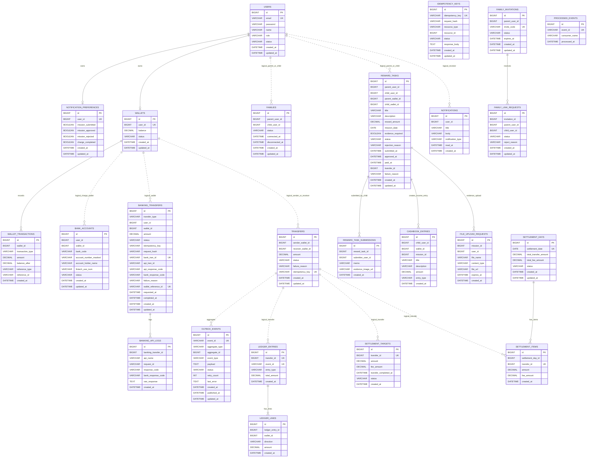

# PayFlow ERD

이 문서는 PayFlow의 전체 테이블 구조를 한 곳에 정리한다.

기준 문서:

```text
docs/implementation-plan/02-database-and-migration.md
docs/implementation-plan/03-user-service.md
docs/implementation-plan/05-transfer-service.md
docs/implementation-plan/06-reward-service.md
docs/implementation-plan/07-open-banking-service.md
docs/implementation-plan/10-ledger-service.md
docs/implementation-plan/11-settlement-service.md
docs/api-spec.md
```

## 설계 원칙

PayFlow는 MSA 구조이므로 서비스별 논리 DB를 분리한다.

```text
payflow_user
payflow_wallet
payflow_banking
payflow_transfer
payflow_reward
payflow_ledger
payflow_settlement
```

서비스는 자기 DB만 직접 접근한다. 다른 서비스의 데이터는 DB foreign key로 강제하지 않고, API 응답으로 받은 식별자를 참조 ID로 저장한다.

예:

```text
wallets.user_id -> users.id
reward_tasks.parent_wallet_id -> wallets.id
ledger_lines.wallet_id -> wallets.id
```

위 관계는 논리 관계이며, 서로 다른 DB 사이의 물리 FK는 만들지 않는다.

## 전체 ERD



## 테이블 요약

| DB | 테이블 | 상태 | 책임 |
|---|---|---|---|
| payflow_user | users | 일부 구현 | 사용자 인증 정보, 역할, 상태 |
| payflow_user | notification_preferences | 설계 | 사용자별 알림 수신 설정 |
| payflow_wallet | wallets | 구현 | 사용자별 지갑 잔액 |
| payflow_wallet | wallet_transactions | 구현 | 지갑 잔액 변경 이력과 중복 반영 방어 |
| payflow_banking | bank_accounts | 설계 | 충전/출금용 외부 계좌 식별자 |
| payflow_banking | banking_transfers | 설계 | 오픈뱅킹 충전/출금/환불 상태 |
| payflow_banking | banking_api_logs | 설계 | 외부 은행망 API 요청/응답 로그 |
| payflow_transfer | transfers | 설계 | 지갑 간 송금 요청과 상태 |
| payflow_transfer | idempotency_keys | 설계 | 송금 API 멱등성 저장소 |
| payflow_transfer | outbox_events | 설계 | Kafka 이벤트 발행 신뢰성 저장소 |
| payflow_reward | families | 설계 | 부모-자녀 연결 |
| payflow_reward | family_invitations | 설계 | 부모 초대 코드 |
| payflow_reward | family_link_requests | 설계 | 자녀 연결 요청 |
| payflow_reward | reward_tasks | 설계 | 미션, 보상금, 지급 상태 |
| payflow_reward | reward_task_submissions | 설계 | 자녀 미션 완료 제출 이력 |
| payflow_reward | cashbook_entries | 설계 | 자녀 수입/지출 캐시북 |
| payflow_reward | notifications | 설계 | 미션/보상/충전 알림 |
| payflow_reward | file_upload_requests | 설계 | 미션 인증 사진 업로드 URL 발급 이력 |
| payflow_ledger | ledger_entries | 설계 | 송금 단위 원장 헤더 |
| payflow_ledger | ledger_lines | 설계 | 차감/증가 원장 라인 |
| payflow_ledger | processed_events | 설계 | Kafka consumer 멱등성 |
| payflow_settlement | settlement_targets | 설계 | 정산 대상 송금 후보 |
| payflow_settlement | settlement_days | 설계 | 일별 정산 합계 |
| payflow_settlement | settlement_items | 설계 | 일별 정산 상세 항목 |

## payflow_user

### users

사용자 계정의 기준 테이블이다.

| 컬럼 | 타입 | 제약 | 설명 |
|---|---|---|---|
| id | BIGINT | PK | 사용자 ID |
| email | VARCHAR(255) | UNIQUE, NOT NULL | 로그인 이메일 |
| password | VARCHAR(255) | NOT NULL | 암호화된 비밀번호 |
| name | VARCHAR(100) | NOT NULL | 사용자 이름 |
| role | VARCHAR(30) | NOT NULL, planned | PARENT, CHILD |
| status | VARCHAR(30) | NOT NULL | ACTIVE, LOCKED, WITHDRAWN |
| created_at | DATETIME | NOT NULL | 생성 시각 |
| updated_at | DATETIME | NOT NULL | 수정 시각 |

현재 코드에는 `role`이 아직 없고, 구현문서/API spec 기준으로 추가 예정이다.

### notification_preferences

사용자별 알림 설정이다.

| 컬럼 | 타입 | 제약 | 설명 |
|---|---|---|---|
| id | BIGINT | PK | 알림 설정 ID |
| user_id | BIGINT | UNIQUE, NOT NULL | 사용자 ID 논리 참조 |
| mission_submitted | BOOLEAN | NOT NULL | 미션 제출 알림 수신 여부 |
| mission_approved | BOOLEAN | NOT NULL | 미션 승인 알림 수신 여부 |
| mission_rejected | BOOLEAN | NOT NULL | 미션 반려 알림 수신 여부 |
| charge_completed | BOOLEAN | NOT NULL | 충전 완료 알림 수신 여부 |
| created_at | DATETIME | NOT NULL | 생성 시각 |
| updated_at | DATETIME | NOT NULL | 수정 시각 |

## payflow_wallet

### wallets

사용자별 지갑 잔액의 진실이다.

| 컬럼 | 타입 | 제약 | 설명 |
|---|---|---|---|
| id | BIGINT | PK | 지갑 ID |
| user_id | BIGINT | UNIQUE, NOT NULL | 사용자 ID 논리 참조 |
| balance | DECIMAL(19,0) | NOT NULL | 현재 잔액 |
| status | VARCHAR(30) | NOT NULL | ACTIVE, LOCKED, CLOSED |
| created_at | DATETIME | NOT NULL | 생성 시각 |
| updated_at | DATETIME | NOT NULL | 수정 시각 |

### wallet_transactions

지갑 잔액 변경 이력이다. 같은 `wallet_id`, `transaction_type`, `reference_type`, `reference_id` 조합은 한 번만 기록한다.

| 컬럼 | 타입 | 제약 | 설명 |
|---|---|---|---|
| id | BIGINT | PK | 거래 이력 ID |
| wallet_id | BIGINT | FK within DB, NOT NULL | 지갑 ID |
| transaction_type | VARCHAR(30) | NOT NULL | DEPOSIT, WITHDRAW |
| amount | DECIMAL(19,0) | NOT NULL | 변경 금액 |
| balance_after | DECIMAL(19,0) | NOT NULL | 변경 후 잔액 |
| reference_type | VARCHAR(50) | NOT NULL | MANUAL_CHARGE, TRANSFER, OPEN_BANKING_CHARGE 등 |
| reference_id | VARCHAR(100) | NOT NULL | 외부 처리 기준 ID |
| created_at | DATETIME | NOT NULL | 생성 시각 |

## payflow_banking

### bank_accounts

충전/출금에 사용할 외부 은행 계좌 식별자다.

| 컬럼 | 타입 | 제약 | 설명 |
|---|---|---|---|
| id | BIGINT | PK | 계좌 ID |
| user_id | BIGINT | NOT NULL | 사용자 ID 논리 참조 |
| wallet_id | BIGINT | NOT NULL | 연결 지갑 ID 논리 참조 |
| bank_code | VARCHAR(10) | NOT NULL | 은행 코드 |
| account_number_masked | VARCHAR(50) | NOT NULL | 마스킹된 계좌번호 |
| account_holder_name | VARCHAR(100) | NOT NULL | 예금주명 |
| fintech_use_num | VARCHAR(100) | INDEX 권장 | 오픈뱅킹 핀테크 이용번호 |
| status | VARCHAR(30) | NOT NULL | ACTIVE, LOCKED, DELETED |
| created_at | DATETIME | NOT NULL | 생성 시각 |
| updated_at | DATETIME | NOT NULL | 수정 시각 |

### banking_transfers

오픈뱅킹 충전, 출금, 환불 요청의 상태를 저장한다.

| 컬럼 | 타입 | 제약 | 설명 |
|---|---|---|---|
| id | BIGINT | PK | 뱅킹 거래 ID |
| transfer_type | VARCHAR(30) | NOT NULL | CHARGE, WITHDRAWAL, REFUND |
| user_id | BIGINT | NOT NULL | 사용자 ID 논리 참조 |
| wallet_id | BIGINT | NOT NULL | 지갑 ID 논리 참조 |
| amount | DECIMAL(19,0) | NOT NULL | 요청 금액 |
| status | VARCHAR(30) | NOT NULL | REQUESTED, BANK_PROCESSING, BANK_SUCCEEDED, WALLET_REFLECTING, COMPLETED, FAILED, UNKNOWN, COMPENSATION_REQUIRED |
| idempotency_key | VARCHAR(255) | UNIQUE 권장 | API 멱등키 |
| request_hash | VARCHAR(255) | NOT NULL | 요청 body hash |
| bank_tran_id | VARCHAR(100) | UNIQUE | 은행망 거래 ID |
| api_tran_id | VARCHAR(100) |  | 은행망 API 거래 ID |
| api_response_code | VARCHAR(20) |  | API 응답 코드 |
| bank_response_code | VARCHAR(20) |  | 은행 응답 코드 |
| failure_reason | VARCHAR(500) |  | 실패 원인 |
| wallet_reference_id | VARCHAR(100) | UNIQUE | wallet-service 반영 중복 방어 기준 |
| requested_at | DATETIME | NOT NULL | 요청 시각 |
| completed_at | DATETIME |  | 완료 시각 |
| created_at | DATETIME | NOT NULL | 생성 시각 |
| updated_at | DATETIME | NOT NULL | 수정 시각 |

### banking_api_logs

외부 은행망 API 호출 로그다.

| 컬럼 | 타입 | 제약 | 설명 |
|---|---|---|---|
| id | BIGINT | PK | 로그 ID |
| banking_transfer_id | BIGINT | FK within DB | 뱅킹 거래 ID |
| api_name | VARCHAR(100) | NOT NULL | API 이름 |
| request_id | VARCHAR(100) | NOT NULL | 요청 추적 ID |
| response_code | VARCHAR(20) |  | API 응답 코드 |
| bank_response_code | VARCHAR(20) |  | 은행 응답 코드 |
| raw_response | TEXT |  | 원문 응답 |
| created_at | DATETIME | NOT NULL | 생성 시각 |

## payflow_transfer

### transfers

지갑 간 송금 상태의 진실이다.

| 컬럼 | 타입 | 제약 | 설명 |
|---|---|---|---|
| id | BIGINT | PK | 송금 ID |
| sender_wallet_id | BIGINT | NOT NULL | 보내는 지갑 ID 논리 참조 |
| receiver_wallet_id | BIGINT | NOT NULL | 받는 지갑 ID 논리 참조 |
| amount | DECIMAL(19,0) | NOT NULL | 송금 금액 |
| status | VARCHAR(30) | NOT NULL | REQUESTED, PROCESSING, COMPLETED, FAILED, COMPENSATION_REQUIRED, ROLLED_BACK, ROLLBACK_FAILED |
| failure_reason | VARCHAR(500) |  | 실패 원인 |
| idempotency_key | VARCHAR(255) | UNIQUE | 송금 요청 멱등키 |
| created_at | DATETIME | NOT NULL | 생성 시각 |
| updated_at | DATETIME | NOT NULL | 수정 시각 |

### idempotency_keys

송금 API 멱등성 저장소다.

| 컬럼 | 타입 | 제약 | 설명 |
|---|---|---|---|
| id | BIGINT | PK | 멱등키 레코드 ID |
| idempotency_key | VARCHAR(255) | UNIQUE, NOT NULL | 클라이언트 멱등키 |
| request_hash | VARCHAR(255) | NOT NULL | 요청 body hash |
| resource_type | VARCHAR(50) | NOT NULL | 연결 리소스 타입 |
| resource_id | BIGINT |  | 연결 리소스 ID |
| status | VARCHAR(30) | NOT NULL | PROCESSING, COMPLETED, FAILED |
| response_body | TEXT |  | 완료 응답 캐시 |
| created_at | DATETIME | NOT NULL | 생성 시각 |
| updated_at | DATETIME | NOT NULL | 수정 시각 |

### outbox_events

송금 후 Kafka 이벤트 발행 신뢰성을 위한 outbox다.

| 컬럼 | 타입 | 제약 | 설명 |
|---|---|---|---|
| id | BIGINT | PK | Outbox ID |
| event_id | VARCHAR(100) | UNIQUE, NOT NULL | 이벤트 ID |
| aggregate_type | VARCHAR(50) | NOT NULL | aggregate 타입 |
| aggregate_id | BIGINT | NOT NULL | aggregate ID |
| event_type | VARCHAR(100) | NOT NULL | 이벤트 타입 |
| payload | TEXT | NOT NULL | 이벤트 payload |
| status | VARCHAR(30) | NOT NULL | READY, PUBLISHED, FAILED |
| retry_count | INT | NOT NULL | 발행 재시도 횟수 |
| last_error | TEXT |  | 마지막 실패 원인 |
| created_at | DATETIME | NOT NULL | 생성 시각 |
| published_at | DATETIME |  | 발행 성공 시각 |
| updated_at | DATETIME | NOT NULL | 수정 시각 |

## payflow_reward

### families

부모와 자녀의 연결 상태다.

| 컬럼 | 타입 | 제약 | 설명 |
|---|---|---|---|
| id | BIGINT | PK | 가족 연결 ID |
| parent_user_id | BIGINT | NOT NULL | 부모 사용자 ID 논리 참조 |
| child_user_id | BIGINT | NOT NULL | 자녀 사용자 ID 논리 참조 |
| status | VARCHAR(30) | NOT NULL | CONNECTED, DISCONNECTED 등 |
| connected_at | DATETIME |  | 연결 시각 |
| disconnected_at | DATETIME |  | 해제 시각 |
| created_at | DATETIME | NOT NULL | 생성 시각 |
| updated_at | DATETIME | NOT NULL | 수정 시각 |

### family_invitations

부모가 생성한 초대 코드다.

| 컬럼 | 타입 | 제약 | 설명 |
|---|---|---|---|
| id | BIGINT | PK | 초대 ID |
| parent_user_id | BIGINT | NOT NULL | 부모 사용자 ID 논리 참조 |
| invite_code | VARCHAR(30) | UNIQUE, NOT NULL | 초대 코드 |
| status | VARCHAR(30) | NOT NULL | ACTIVE, USED, EXPIRED |
| expires_at | DATETIME | NOT NULL | 만료 시각 |
| created_at | DATETIME | NOT NULL | 생성 시각 |
| updated_at | DATETIME | NOT NULL | 수정 시각 |

### family_link_requests

자녀가 초대 코드를 입력해 만든 연결 요청이다.

| 컬럼 | 타입 | 제약 | 설명 |
|---|---|---|---|
| id | BIGINT | PK | 연결 요청 ID |
| invitation_id | BIGINT | FK within DB | 초대 ID |
| parent_user_id | BIGINT | NOT NULL | 부모 사용자 ID 논리 참조 |
| child_user_id | BIGINT | NOT NULL | 자녀 사용자 ID 논리 참조 |
| status | VARCHAR(30) | NOT NULL | REQUESTED, APPROVED, REJECTED, CANCELED |
| reject_reason | VARCHAR(500) |  | 거절 사유 |
| created_at | DATETIME | NOT NULL | 생성 시각 |
| updated_at | DATETIME | NOT NULL | 수정 시각 |

### reward_tasks

부모가 자녀에게 등록한 미션과 보상 지급 상태다.

| 컬럼 | 타입 | 제약 | 설명 |
|---|---|---|---|
| id | BIGINT | PK | 미션 ID |
| parent_user_id | BIGINT | NOT NULL | 부모 사용자 ID 논리 참조 |
| child_user_id | BIGINT | NOT NULL | 자녀 사용자 ID 논리 참조 |
| parent_wallet_id | BIGINT | NOT NULL | 부모 지갑 ID 논리 참조 |
| child_wallet_id | BIGINT | NOT NULL | 자녀 지갑 ID 논리 참조 |
| title | VARCHAR(100) | NOT NULL | 미션 제목 |
| description | VARCHAR(500) |  | 미션 설명 |
| reward_amount | DECIMAL(19,0) | NOT NULL | 보상 금액 |
| mission_date | DATE | NOT NULL | 미션 수행 날짜, 캘린더 기준 |
| evidence_required | BOOLEAN | NOT NULL | 인증 사진 필요 여부 |
| status | VARCHAR(30) | NOT NULL | REGISTERED, SUBMITTED, PAYMENT_PENDING, PAYMENT_FAILED, PAID, REJECTED, CANCELED |
| rejection_reason | VARCHAR(500) |  | 반려 사유 |
| submitted_at | DATETIME |  | 제출 시각 |
| approved_at | DATETIME |  | 승인 시각 |
| paid_at | DATETIME |  | 지급 완료 시각 |
| transfer_id | BIGINT |  | transfer-service 송금 ID 논리 참조 |
| failure_reason | VARCHAR(500) |  | 지급 실패 원인 |
| created_at | DATETIME | NOT NULL | 생성 시각 |
| updated_at | DATETIME | NOT NULL | 수정 시각 |

### reward_task_submissions

자녀의 미션 제출 이력이다. 반려 후 재제출을 위해 여러 건이 생길 수 있다.

| 컬럼 | 타입 | 제약 | 설명 |
|---|---|---|---|
| id | BIGINT | PK | 제출 ID |
| reward_task_id | BIGINT | FK within DB, NOT NULL | 미션 ID |
| submitter_user_id | BIGINT | NOT NULL | 제출한 자녀 사용자 ID 논리 참조 |
| memo | VARCHAR(1000) |  | 제출 메모 |
| evidence_image_url | VARCHAR(1000) |  | 인증 사진 URL |
| created_at | DATETIME | NOT NULL | 생성 시각 |

### cashbook_entries

자녀 캐시북 수입/지출 기록이다.

| 컬럼 | 타입 | 제약 | 설명 |
|---|---|---|---|
| id | BIGINT | PK | 캐시북 항목 ID |
| child_user_id | BIGINT | NOT NULL | 자녀 사용자 ID 논리 참조 |
| wallet_id | BIGINT | NOT NULL | 지갑 ID 논리 참조 |
| mission_id | BIGINT | NULL | 미션 ID, 수동 지출이면 NULL 가능 |
| title | VARCHAR(100) | NOT NULL | 항목 제목 |
| description | VARCHAR(500) |  | 설명 |
| amount | DECIMAL(19,0) | NOT NULL | 금액 |
| entry_type | VARCHAR(30) | NOT NULL | INCOME, EXPENSE |
| created_at | DATETIME | NOT NULL | 생성 시각 |

### notifications

앱 내 알림이다.

| 컬럼 | 타입 | 제약 | 설명 |
|---|---|---|---|
| id | BIGINT | PK | 알림 ID |
| user_id | BIGINT | NOT NULL | 수신 사용자 ID 논리 참조 |
| title | VARCHAR(100) | NOT NULL | 제목 |
| body | VARCHAR(500) | NOT NULL | 내용 |
| notification_type | VARCHAR(50) | NOT NULL | 알림 타입 |
| read_at | DATETIME | NULL | 읽은 시각 |
| created_at | DATETIME | NOT NULL | 생성 시각 |

### file_upload_requests

미션 인증 사진 업로드 URL 발급 이력이다.

| 컬럼 | 타입 | 제약 | 설명 |
|---|---|---|---|
| id | BIGINT | PK | 업로드 요청 ID |
| mission_id | BIGINT | NOT NULL | 미션 ID |
| user_id | BIGINT | NOT NULL | 요청 사용자 ID 논리 참조 |
| file_name | VARCHAR(255) | NOT NULL | 파일명 |
| content_type | VARCHAR(100) | NOT NULL | MIME 타입 |
| file_url | VARCHAR(1000) | NOT NULL | 업로드 후 접근 URL 또는 object URL |
| expires_at | DATETIME | NOT NULL | 업로드 URL 만료 시각 |
| created_at | DATETIME | NOT NULL | 생성 시각 |

## payflow_ledger

### ledger_entries

송금 단위 원장 헤더다.

| 컬럼 | 타입 | 제약 | 설명 |
|---|---|---|---|
| id | BIGINT | PK | 원장 헤더 ID |
| transfer_id | BIGINT | UNIQUE, NOT NULL | 송금 ID 논리 참조 |
| event_id | VARCHAR(100) | UNIQUE, NOT NULL | Kafka 이벤트 ID |
| entry_type | VARCHAR(50) | NOT NULL | 원장 유형 |
| total_amount | DECIMAL(19,0) | NOT NULL | 총 금액 |
| created_at | DATETIME | NOT NULL | 생성 시각 |

### ledger_lines

원장 상세 라인이다. 송금 한 건당 최소 두 라인을 만든다.

| 컬럼 | 타입 | 제약 | 설명 |
|---|---|---|---|
| id | BIGINT | PK | 원장 라인 ID |
| ledger_entry_id | BIGINT | FK within DB, NOT NULL | 원장 헤더 ID |
| wallet_id | BIGINT | NOT NULL | 지갑 ID 논리 참조 |
| direction | VARCHAR(10) | NOT NULL | DEBIT, CREDIT |
| amount | DECIMAL(19,0) | NOT NULL | 금액 |
| created_at | DATETIME | NOT NULL | 생성 시각 |

### processed_events

Kafka consumer 중복 처리를 막기 위한 처리 이력이다.

| 컬럼 | 타입 | 제약 | 설명 |
|---|---|---|---|
| id | BIGINT | PK | 처리 이력 ID |
| event_id | VARCHAR(100) | UNIQUE, NOT NULL | Kafka 이벤트 ID |
| consumer_name | VARCHAR(100) | NOT NULL | consumer 이름 |
| processed_at | DATETIME | NOT NULL | 처리 시각 |

## payflow_settlement

### settlement_targets

정산 대상 후보 송금이다. `transfer.completed` 또는 `ledger.recorded` 이벤트를 소비해 생성한다.

| 컬럼 | 타입 | 제약 | 설명 |
|---|---|---|---|
| id | BIGINT | PK | 정산 대상 ID |
| transfer_id | BIGINT | UNIQUE, NOT NULL | 송금 ID 논리 참조 |
| amount | DECIMAL(19,0) | NOT NULL | 송금 금액 |
| fee_amount | DECIMAL(19,0) | NOT NULL | 예상 수수료 |
| transfer_completed_at | DATETIME | NOT NULL | 송금 완료 시각 |
| status | VARCHAR(30) | NOT NULL | READY, SETTLED 등 |
| created_at | DATETIME | NOT NULL | 생성 시각 |

### settlement_days

일별 정산 합계다.

| 컬럼 | 타입 | 제약 | 설명 |
|---|---|---|---|
| id | BIGINT | PK | 정산일 ID |
| settlement_date | DATE | UNIQUE, NOT NULL | 정산 기준일 |
| total_transfer_amount | DECIMAL(19,0) | NOT NULL | 총 송금액 |
| total_fee_amount | DECIMAL(19,0) | NOT NULL | 총 수수료 |
| status | VARCHAR(30) | NOT NULL | READY, COMPLETED, FAILED 등 |
| created_at | DATETIME | NOT NULL | 생성 시각 |
| updated_at | DATETIME | NOT NULL | 수정 시각 |

### settlement_items

일별 정산 상세 항목이다.

| 컬럼 | 타입 | 제약 | 설명 |
|---|---|---|---|
| id | BIGINT | PK | 정산 상세 ID |
| settlement_day_id | BIGINT | FK within DB, NOT NULL | 정산일 ID |
| transfer_id | BIGINT | UNIQUE, NOT NULL | 송금 ID 논리 참조 |
| amount | DECIMAL(19,0) | NOT NULL | 송금 금액 |
| fee_amount | DECIMAL(19,0) | NOT NULL | 수수료 |
| created_at | DATETIME | NOT NULL | 생성 시각 |

## 주요 인덱스와 유니크 제약

| 테이블 | 인덱스/제약 | 목적 |
|---|---|---|
| users | UNIQUE(email) | 이메일 중복 가입 방지 |
| notification_preferences | UNIQUE(user_id) | 사용자별 설정 1건 유지 |
| wallets | UNIQUE(user_id) | 사용자별 지갑 1개 유지 |
| wallet_transactions | INDEX(wallet_id) | 지갑별 이력 조회 |
| wallet_transactions | UNIQUE(wallet_id, transaction_type, reference_type, reference_id) | 잔액 중복 반영 방지 |
| bank_accounts | INDEX(user_id), INDEX(wallet_id), INDEX(fintech_use_num) | 사용자/지갑/외부 계좌 조회 |
| banking_transfers | UNIQUE(idempotency_key) | 충전/출금 API 멱등성 |
| banking_transfers | UNIQUE(bank_tran_id) | 은행망 거래 중복 방지 |
| banking_transfers | UNIQUE(wallet_reference_id) | wallet-service 반영 중복 방지 |
| banking_transfers | INDEX(status) | 상태별 복구/조회 |
| transfers | UNIQUE(idempotency_key) | 송금 API 멱등성 |
| transfers | INDEX(status) | 상태별 복구/조회 |
| idempotency_keys | UNIQUE(idempotency_key) | 멱등키 중복 방지 |
| outbox_events | UNIQUE(event_id) | 이벤트 중복 방지 |
| outbox_events | INDEX(status), INDEX(status, created_at) | publisher 대상 조회 |
| family_invitations | UNIQUE(invite_code) | 초대 코드 중복 방지 |
| reward_tasks | INDEX(child_user_id, mission_date) | 자녀 월별 미션 캘린더 |
| reward_tasks | INDEX(parent_user_id, mission_date) | 부모 자녀별 미션 조회 |
| reward_tasks | INDEX(status) | 제출/지급 상태 조회 |
| cashbook_entries | INDEX(child_user_id, created_at) | 자녀 캐시북 조회 |
| notifications | INDEX(user_id, read_at), INDEX(user_id, created_at) | 알림 목록/안 읽은 개수 |
| ledger_entries | UNIQUE(transfer_id), UNIQUE(event_id) | 송금별 원장/이벤트 중복 방지 |
| processed_events | UNIQUE(event_id) | consumer 멱등성 |
| settlement_targets | UNIQUE(transfer_id) | 정산 후보 중복 방지 |
| settlement_days | UNIQUE(settlement_date) | 같은 날짜 중복 정산 방지 |
| settlement_items | UNIQUE(transfer_id) | 같은 송금 중복 정산 방지 |

## 상태 값

| 도메인 | 값 |
|---|---|
| UserStatus | ACTIVE, LOCKED, WITHDRAWN |
| UserRole | PARENT, CHILD |
| WalletStatus | ACTIVE, LOCKED, CLOSED |
| WalletTransactionType | DEPOSIT, WITHDRAW |
| WalletReferenceType | MANUAL_CHARGE, TRANSFER, OPEN_BANKING_CHARGE, OPEN_BANKING_WITHDRAWAL, OPEN_BANKING_REFUND |
| BankAccountStatus | ACTIVE, LOCKED, DELETED |
| BankingTransferType | CHARGE, WITHDRAWAL, REFUND |
| BankingTransferStatus | REQUESTED, BANK_PROCESSING, BANK_SUCCEEDED, WALLET_REFLECTING, COMPLETED, FAILED, UNKNOWN, COMPENSATION_REQUIRED |
| TransferStatus | REQUESTED, PROCESSING, COMPLETED, FAILED, COMPENSATION_REQUIRED, ROLLED_BACK, ROLLBACK_FAILED |
| IdempotencyStatus | PROCESSING, COMPLETED, FAILED |
| OutboxStatus | READY, PUBLISHED, FAILED |
| FamilyInvitationStatus | ACTIVE, USED, EXPIRED |
| FamilyLinkStatus | REQUESTED, APPROVED, REJECTED, CANCELED |
| MissionStatus | REGISTERED, SUBMITTED, PAYMENT_PENDING, PAYMENT_FAILED, PAID, REJECTED, CANCELED |
| CashbookEntryType | INCOME, EXPENSE |
| LedgerLineDirection | DEBIT, CREDIT |
| SettlementTargetStatus | READY, SETTLED |
| SettlementDayStatus | READY, COMPLETED, FAILED |

## 구현 시 주의사항

- 서비스 간 DB foreign key는 만들지 않는다.
- 같은 DB 안의 관계는 FK를 둘 수 있다. 예: `wallet_transactions.wallet_id`, `ledger_lines.ledger_entry_id`.
- 금액은 모두 `DECIMAL(19,0)`을 사용한다.
- 외부 계좌번호 원문과 민감 응답은 저장하지 않는다.
- `wallet_transactions`, `idempotency_keys`, `outbox_events`, `processed_events`는 결제 정합성의 핵심 테이블이다.
- `reward_tasks.mission_date`는 미션 캘린더의 기준 날짜다.
- 보상 지급 완료 시 `reward_tasks.transfer_id`, `paid_at`, `cashbook_entries`가 같은 사건을 가리켜야 한다.
- 운영용 DDL 확정 전에는 현재 구현 엔티티와 이 문서의 planned 컬럼 차이를 확인한다.
