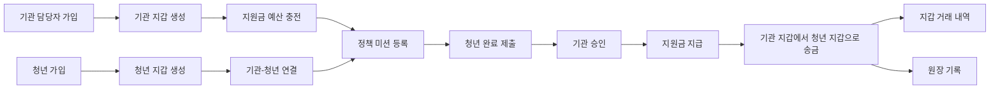

# PayFlow 서비스 기획 문서

> 도메인 전환 안내: 현재 PayFlow는 **청년 정책 참여 미션 및 지원금 지급 플랫폼**으로 설명한다. 내부 구현 호환성을 위해 `PARENT`/`CHILD`, `/api/families`, `/api/missions`, `/api/cashbook`, `reward-service` 같은 명칭은 유지하지만, 문서와 발표에서는 각각 **기관 담당자**, **청년 참여자**, **참여자 연결**, **정책 미션**, **지원금 사용 내역**, **정책 미션/지원금 서비스**로 해석한다.

## 1. 문서 목적

이 문서는 PayFlow를 청년 정책 참여 미션 및 지원금 지급 플랫폼으로 설명하기 위한 기획 문서다. 프로젝트명과 내부 MSA 구조는 유지하고, 서비스 관점만 기관-청년 정책 지원 흐름으로 정리한다.

## 2. 서비스 소개

PayFlow는 기관 담당자가 청년 참여자에게 정책 미션을 등록하고, 청년이 참여 결과를 제출하면 담당자가 승인한 뒤 지원금을 지급하는 지갑 기반 서비스다.

단순 정책 안내 앱이 아니라, 정책 참여의 신청/수행/승인/지원금 지급/기록 확인을 하나의 실행 흐름으로 연결하는 것이 핵심이다.

## 3. 해결하려는 문제

| 문제 | PayFlow의 해결 방향 |
| --- | --- |
| 정책 참여 과제와 지급 약속이 흩어진다 | 미션 생성, 제출, 승인, 지급 상태를 하나의 흐름으로 관리한다 |
| 지원금 지급 내역을 추적하기 어렵다 | 지갑 거래 이력과 원장 기록으로 돈의 흐름을 남긴다 |
| 같은 지급 요청이 반복될 수 있다 | 멱등키 기반 송금 요청으로 중복 지급을 막는다 |
| 예산 집행 근거를 설명하기 어렵다 | 정책 미션, 제출 메모, 승인 상태, 지급 기록을 함께 보관한다 |
| 서비스 장애 시 원인 추적이 어렵다 | 거래 상태, 실패 사유, 이벤트/원장 기록을 남긴다 |

## 4. 주요 사용자

### 기관 담당자

기관 담당자는 청년 참여자를 연결하고 정책 미션을 등록한다. 청년이 제출한 결과를 검토해 승인 또는 반려하고, 승인된 미션에는 지원금을 지급한다.

주요 행동:

- 회원가입 및 로그인
- 지원금 예산 충전
- 청년 참여자 연결
- 정책 미션 생성
- 제출 내용 승인 또는 반려
- 지원금 지급
- 지원금 예산 및 지급 기록 확인

### 청년 참여자

청년 참여자는 본인에게 배정된 정책 미션을 확인하고 완료 내용을 제출한다. 승인된 미션의 지원금은 청년 지갑에 입금되며, 사용 내역에서 확인할 수 있다.

주요 행동:

- 회원가입 및 로그인
- 기관 담당자와 연결
- 정책 미션 목록 확인
- 완료 내용 제출 및 재제출
- 지원금 잔액 및 사용 내역 확인
- 계좌 등록 및 출금

## 5. 핵심 사용자 흐름

## 6. MVP 범위

- 회원가입 및 로그인
- 사용자 역할 구분: 내부 구현은 `PARENT`, `CHILD`를 유지하되 화면에서는 기관/청년으로 표현
- 사용자별 지갑 생성 및 조회
- 기관 지원금 예산 충전
- 청년 참여자 연결
- 정책 미션 생성, 제출, 승인, 반려, 지원금 지급
- 청년 지원금 사용 내역 조회
- 송금 완료 이벤트 기반 원장 기록
- Docker Compose 기반 로컬 실행 환경

## 7. 유지하는 내부 구조

최소 변경을 위해 기존 서비스 경계와 API path는 유지한다.

| 기존 내부 명칭 | 서비스 화면/기획 표현 |
| --- | --- |
| Agency | 기관 담당자 |
| Youth | 청년 참여자 |
| Family Link | 참여자 연결 |
| Mission | 정책 미션 |
| Reward | 지원금 |
| Cashbook | 지원금 사용 내역 |
| Credit | 지원금 예산 |

## 8. 서비스별 책임

| 서비스 | 책임 |
| --- | --- |
| api-gateway | 인증, 라우팅, 사용자 헤더 주입 |
| user-service | 회원가입, 로그인, 역할 관리 |
| wallet-service | 지갑 잔액과 거래 내역의 단일 진실 공급원 |
| banking-service | 계좌 연결, 충전, 출금, Toss PG 처리 |
| transfer-service | 기관 지갑에서 청년 지갑으로 지원금 송금, 멱등성, Outbox |
| reward-service | 참여자 연결, 정책 미션 상태 관리, 지원금 지급 요청 |
| ledger-service | 송금/충전 이벤트 기반 원장 기록 |
| settlement-service | 향후 기관별 예산 집행 정산 확장 영역 |

## 9. 핵심 정책

- 지갑 잔액 변경은 `wallet-service`에서만 수행한다.
- `reward-service`는 지원금 지급을 직접 처리하지 않고 `transfer-service`에 송금을 요청한다.
- 지원금 지급은 `reward-payment-{missionId}` 형태의 멱등키를 사용한다.
- 승인/반려/지급 상태는 정책 집행 근거로 남긴다.
- 내부 코드의 `parent`, `child`, `mission`, `reward` 명칭은 리팩터링 비용을 줄이기 위해 유지한다.

## 10. 프로젝트 방향

PayFlow의 핵심은 청년 정책 서비스를 단순 안내가 아니라 실제 지원금 지급까지 이어지는 실행 플랫폼으로 보여주는 것이다. 기존 결제 시스템의 장점인 잔액 정합성, 멱등성, 서비스 경계, 원장 기록을 청년 정책 지원금 도메인에 적용한다.

