# PayFlow 서비스 기획 문서

## 1. 문서 목적

이 문서는 PayFlow 프로젝트를 처음 보는 개발자가 서비스의 목적, 사용자 흐름, 시스템 구조, 핵심 도메인 규칙을 빠르게 이해하도록 돕기 위한 기획 문서다.

PayFlow는 단순한 CRUD 서비스가 아니라 돈의 이동을 다루는 결제형 서비스다. 그래서 화면 기능보다 더 중요한 주제는 다음과 같다.

- 지갑 잔액이 틀어지지 않아야 한다.
- 같은 요청을 다시 보내도 돈이 중복으로 움직이면 안 된다.
- 서비스별 책임이 명확해야 한다.
- 송금 결과는 원장 또는 이벤트 기록으로 추적할 수 있어야 한다.
- 실패한 요청은 상태값과 사유를 통해 복구 가능해야 한다.

## 2. 서비스 한 줄 소개

PayFlow는 부모가 자녀에게 미션을 주고, 자녀가 미션을 완료하면 부모 지갑에서 자녀 지갑으로 보상금을 지급하는 부모-자녀 미션 보상 지갑 서비스다.

## 3. 해결하려는 문제

부모와 자녀 사이의 용돈 지급은 보통 말로 약속하고 현금이나 계좌이체로 처리된다. 이 방식은 다음 문제가 있다.

| 문제 | PayFlow의 해결 방향 |
| --- | --- |
| 미션과 보상 약속이 흩어진다 | 미션 생성, 제출, 승인, 지급 상태를 하나의 흐름으로 관리한다 |
| 용돈 지급 내역을 추적하기 어렵다 | 지갑 거래 이력과 캐시북으로 돈의 흐름을 조회한다 |
| 같은 지급 요청이 반복될 수 있다 | 멱등키와 reference 기반 중복 방지로 중복 지급을 막는다 |
| 잔액 변경 오류가 치명적이다 | wallet-service를 잔액의 단일 진실 공급원으로 둔다 |
| 서비스 장애 시 원인을 찾기 어렵다 | 거래 상태, 실패 사유, 이벤트, 원장 기록을 남긴다 |

## 4. 주요 사용자

### 부모 사용자

부모는 자녀와 연결하고, 미션을 만들고, 미션 완료 여부를 승인한다. 승인된 미션에는 보상금을 지급할 수 있다.

주요 행동:

- 회원가입 및 로그인
- 은행 계좌 등록
- 지갑 충전
- 자녀 연결
- 미션 생성
- 미션 승인 또는 반려
- 보상 지급
- 자녀 캐시북 확인

### 자녀 사용자

자녀는 부모가 만든 미션을 확인하고, 완료 후 제출한다. 지급된 보상은 자녀 지갑에 입금된다.

주요 행동:

- 회원가입 및 로그인
- 부모와 연결
- 미션 목록 확인
- 미션 완료 제출
- 지갑 잔액 및 돈 기록 확인

## 5. 핵심 사용자 시나리오

아래 다이어그램은 부모가 미션을 만들고 자녀에게 보상금을 지급하기까지의 전체 사용자 여정을 요약한다.

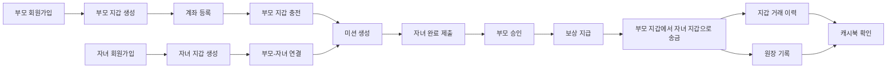

```text
1. 부모와 자녀가 각각 회원가입한다.
2. 각 사용자에게 지갑이 생성된다.
3. 부모가 은행 계좌를 등록한다.
4. 부모가 은행 계좌를 통해 지갑에 크레딧을 충전한다.
5. 부모가 자녀를 연결한다.
6. 부모가 자녀에게 미션과 보상 금액을 등록한다.
7. 자녀가 미션을 완료하고 제출한다.
8. 부모가 제출된 미션을 승인한다.
9. 부모가 보상 지급을 실행한다.
10. transfer-service가 부모 지갑에서 자녀 지갑으로 송금한다.
11. wallet-service가 두 지갑의 잔액과 거래 내역을 기록한다.
12. transfer-service가 송금 완료 이벤트를 발행한다.
13. ledger-service가 이벤트를 소비해 원장 기록을 만든다.
14. 부모와 자녀는 지갑 거래 이력과 캐시북에서 결과를 확인한다.
```

## 6. 서비스 범위

### MVP에 포함하는 기능

- 회원가입 및 로그인
- JWT 기반 인증
- 사용자 역할 구분: `PARENT`, `CHILD`
- 사용자별 지갑 생성 및 조회
- 지갑 입금, 출금, 거래 이력 기록
- 은행 계좌 등록
- 은행 충전 요청
- 사용자 간 지갑 송금
- 부모-자녀 연결
- 미션 생성, 제출, 승인, 반려, 보상 지급
- 자녀 캐시북 요약 조회
- 송금 완료 이벤트 기반 원장 기록
- Docker Compose 기반 로컬 실행 환경

### MVP에서 단순화한 부분

- 실제 오픈뱅킹 연동은 mock 또는 설정 기반으로 단순화한다.
- 가족 그룹 aggregate는 만들지 않고 `parent_child_links`로 표현한다.
- 캐시북 전용 테이블은 만들지 않고 미션과 지갑 거래 데이터를 조합해 조회한다.
- 정산 서비스는 구조상 포함되어 있으나 기본 실행 프로필에서는 선택 기능으로 둔다.
- 원장은 현재 송금 완료 이벤트를 중심으로 기록한다.

## 7. 전체 시스템 구조

PayFlow는 API Gateway를 중심으로 외부 요청을 받고, 각 도메인 서비스가 자신의 DB를 소유하는 MSA 구조다. 돈의 실제 잔액은 wallet-service가 관리하고, 송금 결과는 Kafka 이벤트를 통해 ledger-service로 전달된다.

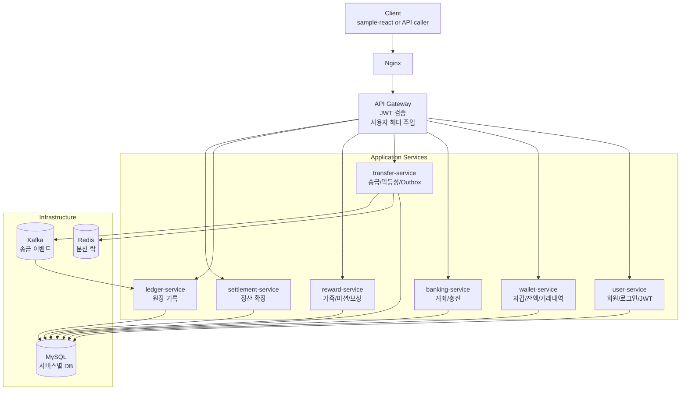

### 컴포넌트 역할

| 컴포넌트 | 주요 책임 |
| --- | --- |
| Nginx | 외부 진입점, API Gateway 앞단 프록시 |
| API Gateway | 라우팅, JWT 검증, `X-User-Id`, `X-User-Role` 헤더 주입 |
| user-service | 회원가입, 로그인, 사용자 정보, JWT 발급 |
| wallet-service | 지갑 생성, 잔액 변경, 거래 내역, 잔액 정합성 |
| banking-service | 계좌 등록, 충전 요청, wallet-service 입금 연동 |
| transfer-service | 사용자 간 송금, 멱등성, 지갑 출금/입금 조율, 송금 이벤트 발행 |
| reward-service | 부모-자녀 연결, 미션 상태 관리, 보상 지급 요청, 캐시북 조회 |
| ledger-service | 송금 완료 이벤트 소비, 원장 기록 |
| settlement-service | 향후 정산/배치 확장을 위한 서비스 |
| MySQL | 서비스별 독립 DB 저장소 |
| Redis | 송금 중 지갑 단위 분산 락 |
| Kafka | 송금 완료/실패 이벤트 전달 |

### 서비스 의존 관계

서비스 간 호출은 DB join이 아니라 HTTP API와 이벤트를 통해 일어난다.

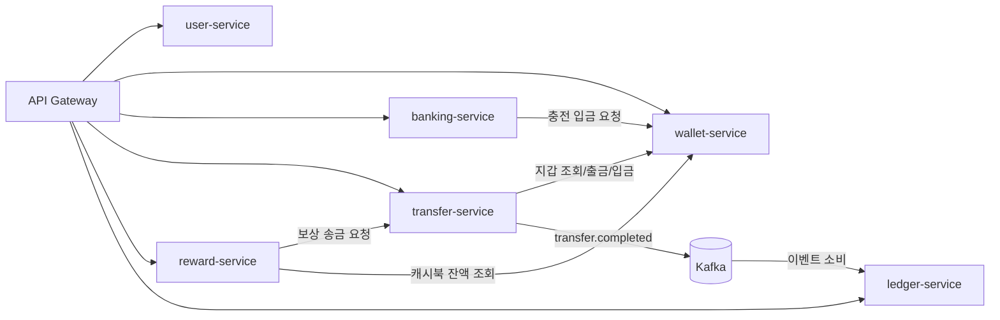

## 8. 서비스별 상세 기획

### 8.1 user-service

사용자 계정의 생명주기를 담당한다.

주요 기능:

- 회원가입
- 로그인
- JWT 발급
- 내 정보 조회
- 사용자 역할 관리

중요 규칙:

- 이메일은 중복될 수 없다.
- 역할은 `PARENT`, `CHILD` 중 하나다.
- 인증 이후의 사용자 식별은 클라이언트가 보낸 userId가 아니라 Gateway가 주입한 `X-User-Id`를 기준으로 한다.

대표 API:

```text
POST /api/users
POST /api/users/login
GET  /api/users/me
GET  /api/users/{userId}
```

### 8.2 wallet-service

돈의 잔액을 실제로 변경하는 핵심 서비스다. PayFlow에서 지갑 잔액의 진실은 오직 wallet-service만 가진다.

주요 기능:

- 사용자 지갑 생성
- 지갑 조회
- 입금
- 출금
- 잔액 변경 거래 내역 저장

중요 규칙:

- 사용자당 지갑은 하나만 생성한다.
- 금액은 원화 정수만 허용한다.
- 잔액 변경은 DB 트랜잭션 안에서 처리한다.
- 잔액 변경 시 지갑 row lock을 사용해 동시성 문제를 줄인다.
- `referenceType + referenceId + transactionType`이 같은 요청은 중복 반영하지 않는다.
- 외부 사용자의 출금은 허용하지 않고, 내부 서비스 호출만 출금할 수 있다.

대표 API:

```text
POST /api/wallets
GET  /api/wallets/{walletId}
GET  /api/wallets/users/{userId}
POST /api/wallets/{walletId}/deposit
POST /api/wallets/{walletId}/withdraw
```

### 8.3 banking-service

은행 계좌와 충전 흐름을 담당한다. 현재 MVP에서는 부모 지갑에 돈을 충전하는 흐름이 중심이다.

주요 기능:

- 은행 계좌 등록
- 내 계좌 목록 조회
- 충전 요청 생성
- 충전 상태 조회
- 충전 성공 시 wallet-service 입금 호출

중요 규칙:

- 충전 요청은 `Idempotency-Key`를 필수로 받는다.
- 같은 멱등키와 같은 요청 본문은 기존 결과를 반환한다.
- 같은 멱등키와 다른 요청 본문은 충돌로 처리한다.
- 계좌 번호는 원문이 아니라 마스킹된 형태로 저장한다.

대표 API:

```text
POST /api/bank/accounts
GET  /api/bank/accounts
POST /api/bank/deposits
GET  /api/bank/transfers/{bankingTransferId}
```

### 8.4 transfer-service

사용자 간 지갑 송금을 조율한다. 실제 잔액 변경은 wallet-service에 요청하고, transfer-service는 송금 요청의 상태와 멱등성을 관리한다.

주요 기능:

- 송금 생성
- 송금 상세 조회
- 내 송금 목록 조회
- 지갑 조회, 출금, 입금 호출
- 송금 완료/실패 이벤트 발행
- Outbox를 통한 이벤트 발행 재시도

중요 규칙:

- 송금 요청은 `Idempotency-Key`를 필수로 받는다.
- 보낸 사람과 받는 사람은 같을 수 없다.
- 송금 금액은 1원 이상 10,000,000원 이하의 정수다.
- 같은 멱등키로 다른 수신자 또는 금액을 보내면 충돌로 처리한다.
- 송금 중 같은 보내는 지갑에 Redis 분산 락을 적용한다.
- 출금 성공 후 입금 실패는 보상 필요 상태로 기록한다.
- 송금 성공 시 Kafka 이벤트를 발행하고 ledger-service가 이를 소비한다.

대표 API:

```text
POST /api/transfers
GET  /api/transfers
GET  /api/transfers/{transferId}
```

### 8.5 reward-service

부모-자녀 관계와 미션 보상 도메인을 담당한다.

주요 기능:

- 부모-자녀 연결
- 연결된 자녀 목록 조회
- 미션 생성
- 미션 목록 및 상세 조회
- 미션 제출
- 미션 승인
- 미션 반려
- 승인된 미션 보상 지급
- 자녀 캐시북 요약 조회

중요 규칙:

- 부모 역할만 자녀 연결과 미션 생성을 할 수 있다.
- 자녀는 본인에게 배정된 미션만 제출할 수 있다.
- 부모는 본인이 만든 미션만 승인 또는 반려할 수 있다.
- 보상 지급은 `reward-payment-{missionId}` 형태의 멱등키로 transfer-service에 요청한다.
- 보상이 성공하면 미션에 `paidTransferId`를 저장하고 상태를 `PAID`로 변경한다.

대표 API:

```text
POST  /api/families/links
GET   /api/families/children
POST  /api/missions
GET   /api/missions
GET   /api/missions/{missionId}
PATCH /api/missions/{missionId}/submit
PATCH /api/missions/{missionId}/approve
PATCH /api/missions/{missionId}/reject
POST  /api/missions/{missionId}/pay
GET   /api/cashbook/children/{childUserId}/summary
GET   /api/cashbook/children/{childUserId}/entries
```

### 8.6 ledger-service

송금 완료 이벤트를 소비해 원장 기록을 만든다. 원장은 돈의 이동을 감사 가능한 형태로 남기기 위한 기록이다.

주요 기능:

- `transfer.completed` 이벤트 소비
- 송금 ID 기준 중복 원장 생성 방지
- 원장 엔트리 저장

중요 규칙:

- 같은 송금 이벤트가 여러 번 전달되어도 원장은 한 번만 기록한다.
- 원장 기록은 지갑 잔액을 바꾸지 않는다. 잔액의 진실은 wallet-service에 있다.
- ledger-service는 조회/감사/정산 확장의 기반이다.

## 9. 데이터 모델 요약

전체 데이터는 서비스별 DB에 나뉘어 저장된다. 실선은 같은 서비스 DB 내부의 관계에 가깝고, 점선은 다른 서비스의 ID를 참조값으로만 들고 있는 관계를 의미한다.

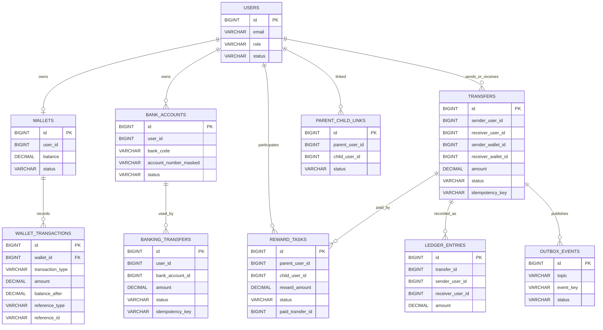

| 서비스 | DB | 주요 테이블 | 설명 |
| --- | --- | --- | --- |
| user-service | `payflow_user` | `users` | 사용자 계정, 역할, 상태 |
| wallet-service | `payflow_wallet` | `wallets`, `wallet_transactions` | 지갑 잔액과 잔액 변경 이력 |
| banking-service | `payflow_banking` | `bank_accounts`, `banking_transfers` | 계좌와 충전 요청 |
| transfer-service | `payflow_transfer` | `transfers`, `outbox_events` | 송금 요청과 이벤트 발행 대기열 |
| reward-service | `payflow_reward` | `parent_child_links`, `reward_tasks` | 가족 연결과 미션 |
| ledger-service | `payflow_ledger` | `ledger_entries` | 송금 완료 원장 기록 |

서비스별 DB를 분리하는 이유는 MSA 경계를 명확히 하기 위해서다. 다른 서비스의 테이블을 직접 join하지 않고, 필요한 정보는 API 호출이나 이벤트로 전달한다.

## 10. 주요 상태값

상태값은 장애 복구와 화면 표시의 기준이 된다. 특히 송금과 미션은 중간 상태를 명확히 남겨야 한다.

### 사용자

```text
ACTIVE
LOCKED
WITHDRAWN
```

### 지갑

```text
ACTIVE
LOCKED
CLOSED
```

### 은행 충전

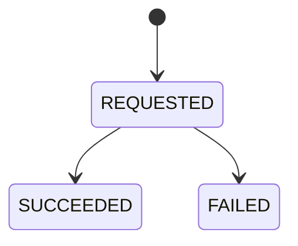

### 송금

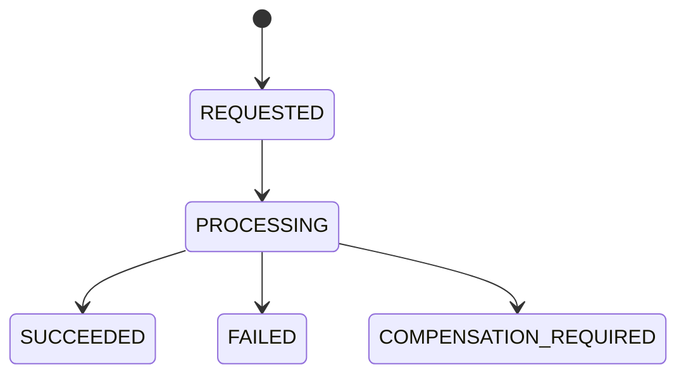

### 미션

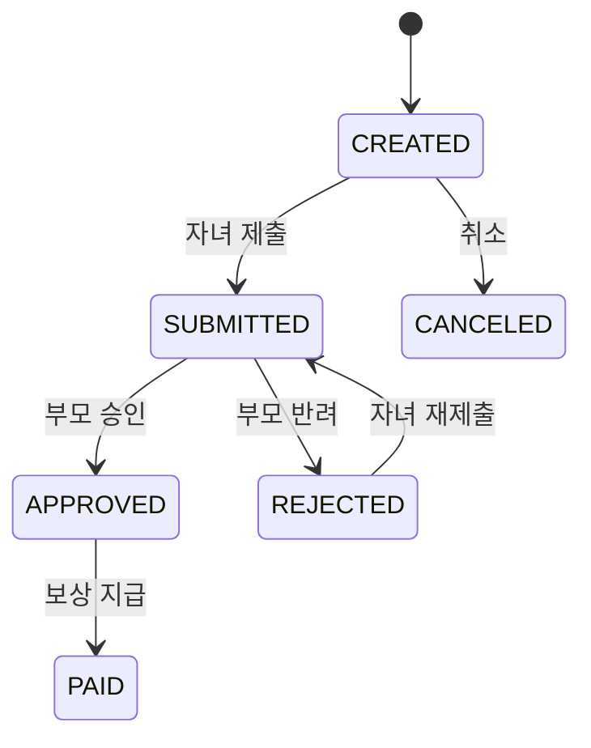

## 11. 핵심 정책

### 11.1 잔액 정합성

잔액 변경은 wallet-service에서만 수행한다. transfer-service나 reward-service는 지갑 DB를 직접 수정하지 않는다.

잔액 변경 시에는 다음을 함께 수행한다.

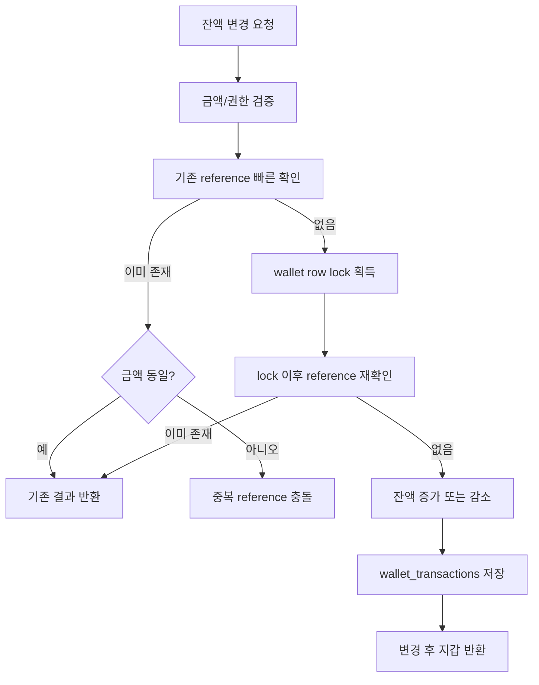

이 구조는 동시 송금, API 재시도, 서비스 간 중복 호출 상황에서도 지갑 잔액이 최대한 일관되도록 만든다.

### 11.2 멱등성

PayFlow에서 멱등성은 별도 공통 테이블이 아니라 업무별 거래 테이블에 저장한다.

| 영역 | 멱등성 기준 |
| --- | --- |
| 은행 충전 | `banking_transfers.idempotency_key`, `request_hash` |
| 송금 | `transfers.idempotency_key`, `request_hash` |
| 지갑 반영 | `wallet_transactions.referenceType`, `referenceId`, `transactionType` |
| 미션 보상 | `reward-payment-{missionId}` |
| 원장 기록 | `transferId` |

같은 요청을 재시도하면 기존 결과를 반환한다. 하지만 같은 키로 요청 내용이 바뀌면 `409 Conflict` 성격의 오류로 처리한다.

### 11.3 서비스 간 인증

외부 요청은 API Gateway에서 JWT를 검증한다. Gateway는 검증된 사용자 정보를 내부 헤더로 전달한다.

```text
X-User-Id
X-User-Role
```

내부 서비스 전용 API는 추가로 다음 헤더를 사용한다.

```text
X-Internal-Request: true
X-Internal-Secret: {shared-secret}
```

이 방식은 클라이언트가 임의로 내부 API를 호출하거나 다른 사용자 ID를 조작하는 위험을 줄인다.

### 11.4 이벤트와 Outbox

transfer-service는 송금 성공/실패 결과를 이벤트로 발행한다. 이벤트 발행은 DB 트랜잭션과 Kafka 발행 사이의 불일치를 줄이기 위해 Outbox 패턴을 사용한다.

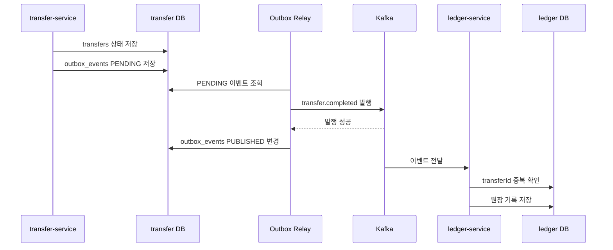

## 12. 대표 플로우 상세

### 12.1 회원가입과 지갑 생성

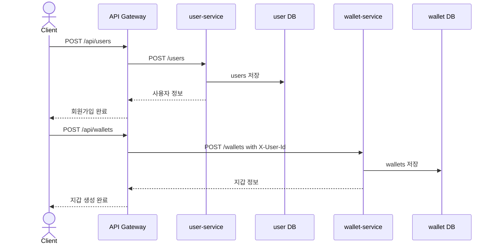

기획상 회원가입과 지갑 생성은 사용자의 시작 흐름으로 묶인다. 구현에서는 사용자 생성과 지갑 생성을 각각의 API로 분리해도 되며, 프론트엔드 또는 BFF 단계에서 순차 호출할 수 있다.

### 12.2 부모 지갑 충전

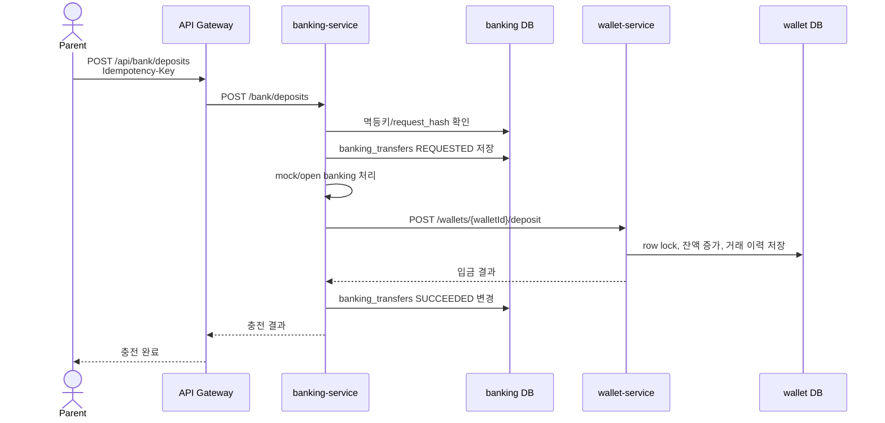

중복 충전 방지를 위해 클라이언트는 `Idempotency-Key`를 반드시 보낸다.

### 12.3 사용자 간 송금

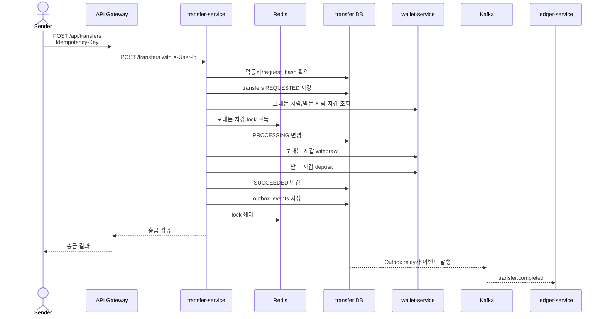

출금 성공 후 입금 실패는 가장 조심해야 하는 구간이다. 현재 구조에서는 `COMPENSATION_REQUIRED` 성격의 상태와 실패 사유를 남겨 운영자가 확인하고 후속 보상 처리를 설계할 수 있게 한다.

### 12.4 미션 보상 지급

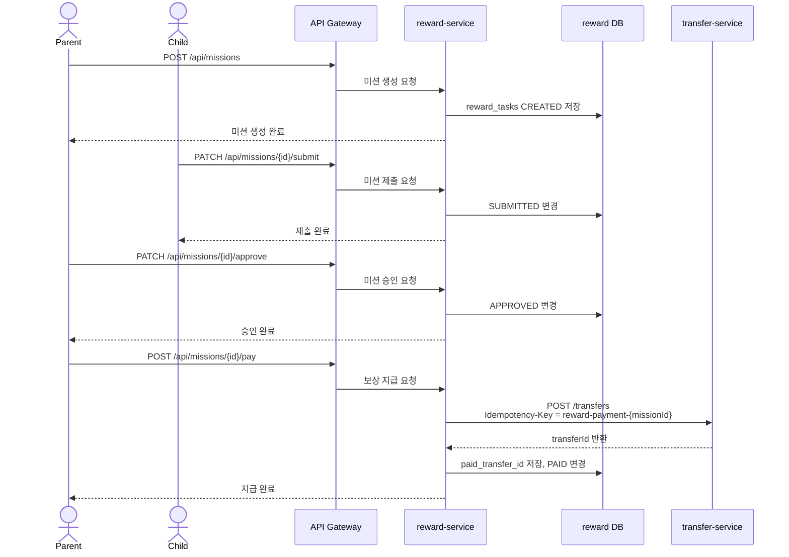

보상 지급은 일반 송금 기능을 재사용한다. reward-service가 직접 지갑 잔액을 바꾸지 않는 것이 핵심이다.

## 13. API Gateway 라우팅

현재 Gateway 기준 주요 라우팅은 다음과 같다.

| 외부 경로 | 대상 서비스 |
| --- | --- |
| `/api/users/**` | user-service |
| `/api/wallets/**` | wallet-service |
| `/api/bank/**` | banking-service |
| `/api/transfers/**` | transfer-service |
| `/api/families/**` | reward-service |
| `/api/missions/**` | reward-service |
| `/api/cashbook/**` | reward-service |
| `/api/ledgers/**` | ledger-service |
| `/api/settlements/**` | settlement-service |

Gateway는 `StripPrefix=1`을 사용하므로 `/api/transfers` 요청은 내부 서비스에서 `/transfers`로 전달된다.

## 14. 프론트엔드 화면 구성

`sample-react`는 PayFlow의 주요 사용자 흐름을 검증하기 위한 React Native/Expo 기반 샘플 앱이다.

대표 화면:

- 로그인
- 역할 선택 회원가입
- 부모-자녀 연결
- 부모 홈
- 크레딧 충전
- 미션 생성
- 자녀 홈
- 미션 제출
- 부모 승인
- 반려 후 재제출
- 계좌 등록
- 자녀 출금 또는 은행 관련 화면

프론트엔드는 API 성공만 확인하는 데 그치지 않고, 다음 상태를 사용자에게 분명히 보여줘야 한다.

- 처리 중
- 성공
- 실패
- 재시도 가능
- 승인 대기
- 반려
- 지급 완료

## 15. 개발자가 알아야 할 경계

### 직접 DB 접근 금지

다른 서비스의 DB를 직접 조회하거나 수정하지 않는다. 예를 들어 reward-service가 보상 지급을 위해 wallet DB를 수정하면 안 된다. 반드시 transfer-service를 통해 송금을 요청해야 한다.

### 돈의 이동은 한 곳에서 추적

잔액 변경의 실제 기록은 `wallet_transactions`에 남긴다. 송금 요청의 업무 상태는 `transfers`에 남긴다. 두 테이블은 역할이 다르다.

```text
transfers: 송금 업무 요청과 결과
wallet_transactions: 실제 지갑 잔액 변경 이력
ledger_entries: 감사/정산 관점의 원장 기록
```

### 실패를 정상 시나리오로 다루기

결제 서비스에서 실패는 예외적인 일이 아니라 정상적으로 설계해야 하는 상태다.

예:

- 잔액 부족
- 지갑 잠금
- 중복 요청
- 멱등키 충돌
- 내부 서비스 호출 실패
- 출금 후 입금 실패
- Kafka 발행 실패

따라서 실패 사유와 상태값은 사용자가 보는 메시지뿐 아니라 운영자가 복구할 수 있는 단서가 되어야 한다.

## 16. 운영 및 실행 구조

로컬 실행은 Docker Compose를 기준으로 한다.

```bash
cp .env.example .env
docker compose up -d
```

인프라만 먼저 실행할 수도 있다.

```bash
docker compose -f docker-compose.infra.yml up -d
```

기본 포트:

| 컴포넌트 | 포트 |
| --- | --- |
| Nginx | 80 |
| API Gateway | 8080 |
| user-service | 8081 |
| wallet-service | 8082 |
| transfer-service | 8083 |
| ledger-service | 8084 |
| settlement-service | 8085 |
| banking-service | 8086 |
| reward-service | 8087 |
| MySQL | 3306 |
| Redis | 6379 |
| Kafka | 9092 |

## 17. 테스트 관점

개발자는 기능 구현 시 다음 테스트를 우선 고려한다.

| 테스트 주제 | 검증 내용 |
| --- | --- |
| 회원가입 | 이메일 중복 방지, 역할 저장, 로그인 가능 여부 |
| 지갑 생성 | 사용자당 지갑 1개 보장 |
| 지갑 입출금 | 잔액 증가/감소와 거래 내역 저장 |
| 지갑 멱등성 | 같은 reference 재요청 시 잔액 중복 변경 방지 |
| 동시 출금 | row lock으로 잔액 음수 또는 lost update 방지 |
| 충전 멱등성 | 같은 `Idempotency-Key` 재요청 처리 |
| 송금 멱등성 | 중복 송금으로 중복 출금되지 않는지 확인 |
| 송금 실패 | 실패 상태와 failureReason 저장 |
| 보상 지급 | 같은 미션이 두 번 지급되지 않는지 확인 |
| 이벤트 발행 | outbox event 생성과 relay 상태 변경 |
| 원장 기록 | 같은 transferId 이벤트 중복 소비 방지 |
| 권한 | 부모/자녀 역할별 API 접근 제한 |

## 18. 향후 확장 방향

### 정산

현재는 송금 완료 원장 기록까지만 다룬다. 이후에는 일별/월별 정산 배치, 수수료 계산, 미정산 거래 대사 기능을 추가할 수 있다.

### 보상 처리 자동화

출금 성공 후 입금 실패 같은 중간 실패를 자동 복구하는 보상 트랜잭션을 추가할 수 있다.

예:

- 입금 재시도
- 출금 환불
- 운영자 승인 기반 수동 복구

### 실 오픈뱅킹 연동

mock 충전 흐름을 실제 오픈뱅킹 인증, 토큰 관리, 계좌 검증, 이체 결과 조회로 확장할 수 있다.

### 알림

미션 생성, 제출, 승인, 지급 완료 이벤트를 기반으로 푸시 알림 또는 이메일 알림을 붙일 수 있다.

### 관측성

서비스별 로그, traceId, metric, Kafka lag, Outbox 미발행 건수, 실패 송금 수를 모니터링하면 운영 품질을 높일 수 있다.

## 19. 개발 시작 가이드

처음 합류한 개발자는 다음 순서로 보면 이해가 빠르다.

```text
1. README.md
2. docs/payflow-service-planning.md
3. docs/service-flow.md
4. docs/api-spec.md
5. docs/erd.md
6. 각 서비스의 Controller
7. 각 서비스의 Service
8. 각 서비스의 테스트 코드
```

특히 돈이 움직이는 흐름을 이해하려면 다음 파일을 우선 확인한다.

```text
wallet-service/src/main/java/com/payflow/wallet/service/WalletService.java
transfer-service/src/main/java/com/payflow/transfer/service/TransferService.java
reward-service/src/main/java/com/payflow/reward/service/RewardService.java
ledger-service/src/main/java/com/payflow/ledger/service/LedgerService.java
```

## 20. 결론

PayFlow의 핵심은 "부모가 자녀에게 미션 보상을 지급한다"는 쉬운 사용자 경험 뒤에, 실제 결제 시스템에서 중요한 잔액 정합성, 멱등성, 서비스 경계, 이벤트 기반 기록을 녹여낸다는 점이다.

개발할 때는 화면의 버튼 하나가 어떤 서비스의 어떤 상태를 바꾸고, 그 결과가 지갑 잔액과 원장에 어떻게 남는지를 항상 함께 생각해야 한다. 이 관점만 유지하면 PayFlow의 구조는 꽤 단순하고 예측 가능하게 확장할 수 있다.
