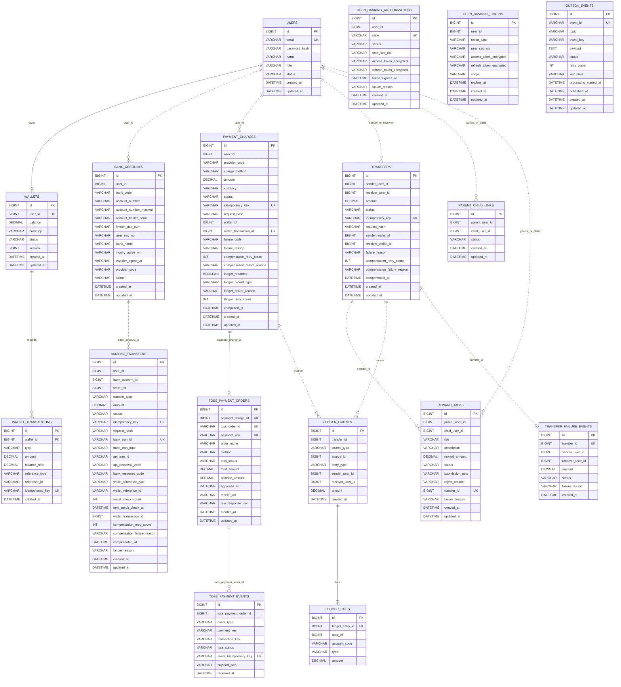

# ERD

> 도메인 전환 안내: 현재 PayFlow는 **청년 정책 참여 미션 및 지원금 지급 플랫폼**으로 설명한다. 내부 구현 호환성을 위해 `PARENT`/`CHILD`, `/api/families`, `/api/missions`, `/api/cashbook`, `reward-service` 같은 명칭은 유지하지만, 문서와 발표에서는 각각 **기관 담당자**, **청년 참여자**, **참여자 연결**, **정책 미션**, **지원금 사용 내역**, **정책 미션/지원금 서비스**로 해석한다.

PayFlow는 서비스별 DB를 분리합니다. 다른 서비스의 테이블을 직접 join하지 않고, 필요한 경우 API 호출이나 이벤트로 식별자만 주고받습니다.

## Databases

| DB | Owner |
| --- | --- |
| `payflow_user` | user-service |
| `payflow_wallet` | wallet-service |
| `payflow_banking` | banking-service |
| `payflow_transfer` | transfer-service |
| `payflow_reward` | reward-service |
| `payflow_ledger` | ledger-service |
| `payflow_settlement` | settlement-service |

## Mermaid ERD

## Core Tables

### users

사용자 계정, 역할, 상태를 저장합니다.

- `email` UNIQUE
- `role`: `PARENT`, `CHILD`
- 인증 이후 사용자 식별은 Gateway가 주입한 `X-User-Id` 기준

### wallets

사용자별 지갑 잔액의 단일 진실 공급원입니다.

- `user_id` UNIQUE — 사용자당 지갑 1개
- 금액은 `DECIMAL(19,0)` 정수 원화 단위
- 잔액 변경은 wallet-service 트랜잭션 안에서만 수행

### wallet_transactions

모든 지갑 잔액 변경 근거를 저장합니다.

- `idempotency_key` UNIQUE — 같은 원천 거래의 중복 반영 방지
- `reference_type` + `reference_id`로 어떤 거래에서 발생한 변경인지 추적
- `reference_type` 값: `BANKING_DEPOSIT`, `TRANSFER_DEBIT`, `TRANSFER_CREDIT`, `REWARD_PAYMENT`, `TRANSFER_COMPENSATION`

### bank_accounts

연결된 외부 은행 계좌 정보를 저장합니다.

- `fintech_use_num`: 오픈뱅킹 이체 API에서 계좌번호 대신 사용하는 식별자
- `user_seq_no`: 오픈뱅킹 사용자 일련번호
- 계좌번호 원문은 `account_number` 컬럼에 저장하나, API 응답에는 `account_number_masked`만 반환

### banking_transfers

오픈뱅킹 충전(`CHARGE`) 및 출금(`WITHDRAWAL`) 요청 상태를 저장합니다.

- `idempotency_key` UNIQUE — 같은 요청 반복 방어
- `request_hash` — 같은 key에 다른 body 요청을 409로 차단
- `bank_tran_id` UNIQUE — 오픈뱅킹 거래고유번호, 결과조회에 필요
- 오픈뱅킹 응답이 모호하면 `BANK_PROCESSING`으로 두고 스케줄러가 결과 재조회

상태: `REQUESTED` → `BANK_PROCESSING` / `BANK_SUCCEEDED` → `WALLET_REFLECTING` → `COMPLETED` / `FAILED` / `COMPENSATION_REQUIRED` → `COMPENSATED`

### open_banking_authorizations

오픈뱅킹 OAuth 인가 요청 세션을 관리합니다.

- `state` UNIQUE — OAuth state로 callback 매핑
- 인가 완료 시 토큰을 `open_banking_tokens`에 암호화하여 저장

### open_banking_tokens

사용자별 오픈뱅킹 액세스/리프레시 토큰을 암호화하여 보관합니다.

- `(user_id, token_type)` UNIQUE
- `token_type`: `ACCESS`, `REFRESH`
- 토큰 원문은 절대 평문으로 저장하지 않음

### payment_charges

Toss PG 충전 요청 상태를 관리합니다.

- `idempotency_key` UNIQUE
- `wallet_transaction_id` UNIQUE — 지갑 반영 중복 방지
- 지갑 입금 실패 시 `COMPENSATION_REQUIRED` → `/charges/{id}/compensate`로 재입금
- 원장 기록 실패 시 `ledgerRecorded=false` → `/charges/{id}/ledger-compensate`로 재기록

상태: `READY` → `PAYMENT_APPROVED` → `WALLET_REFLECTING` → `COMPLETED` / `FAILED` / `COMPENSATION_REQUIRED`

### toss_payment_orders

Toss 주문 정보와 결제 결과를 보관합니다. `payment_charges`와 1:1 관계.

- `toss_order_id`, `payment_key` UNIQUE
- `raw_response_json`: Toss API 원문 응답 저장

### toss_payment_events

Toss 웹훅을 수신한 기록을 보관합니다.

- `event_idempotency_key` UNIQUE — 웹훅 중복 처리 방지

### transfers

사용자 간 지갑 송금을 저장합니다.

- `idempotency_key` UNIQUE
- `request_hash` — 같은 key 다른 body 방어
- `sender_wallet_id`, `receiver_wallet_id` — debit/credit 완료 후 기록
- 출금 후 입금 실패 시 `COMPENSATION_REQUIRED` → `/transfers/compensations/{id}/refund`

상태: `REQUESTED` → `PROCESSING` → `SUCCEEDED` / `FAILED` / `COMPENSATION_REQUIRED` → `COMPENSATED`

### outbox_events

송금 상태 변경과 Kafka 발행 의도를 같은 DB 트랜잭션에 저장하기 위한 Transactional Outbox 테이블입니다.

- `event_id` UNIQUE — 이벤트 UUID
- Relay가 `PENDING` → `PROCESSING` → `PUBLISHED` 순으로 처리
- 발행 실패 시 `FAILED`, `retry_count` 증가, max retry 전까지 재시도

### reward_tasks

미션과 지원금 지급 상태를 저장합니다.

- `transfer_id` UNIQUE — 보상 중복 지급 방지
- `submission_note`: 청년 제출 메모
- `reject_reason`: 기관 반려 사유
- `failure_reason`: 지원금 지급 실패 사유 (상태는 APPROVED 유지)

상태: `CREATED` → `SUBMITTED` → `APPROVED` → `PAID` / `REJECTED` / `CANCELED`

### ledger_entries / ledger_lines

복식부기 형태의 원장을 저장합니다.

- `UNIQUE(source_type, source_id)` — 같은 원천 거래 중복 기록 방지
- `source_type`: `TRANSFER`, `TOSS_CHARGE`, `TOSS_CANCEL`, `OPEN_BANKING_CHARGE`
- `account_code`: `USER_WALLET_OUT`, `USER_WALLET_IN`, `PG_CASH`
- 차변(DEBIT) 합계와 대변(CREDIT) 합계는 항상 같아야 함
- 원장은 수정하지 않음

### transfer_failure_events

`transfer.failed` Kafka 이벤트를 소비해 저장하는 실패 추적 테이블입니다.

- `transfer_id` UNIQUE — 중복 저장 방지

## Modeling Decisions

| 결정 | 이유 |
| --- | --- |
| 서비스별 DB 분리 | MSA 경계와 소유권을 명확히 하기 위해 |
| cross-service FK 미사용 | 다른 서비스 DB에 직접 의존하지 않기 위해 |
| wallet-service 단일 잔액 소유 | 금액 정합성 책임을 한 곳에 모으기 위해 |
| idempotency_key + request_hash | API 멱등성과 body 위조 방어를 함께 처리하기 위해 |
| wallet reference 기반 중복 방어 | 동일 원천 거래의 지갑 중복 반영을 DB 제약으로 막기 위해 |
| outbox 테이블 사용 | DB 변경과 Kafka 발행 사이의 유실을 막기 위해 |
| 보상 retry metadata 저장 | 운영자가 재시도 횟수와 실패 사유를 API로 확인할 수 있게 하기 위해 |
| ledger 원장 불변 | 정정이 필요한 경우 새 전표로 남기는 회계 원칙을 따르기 위해 |

