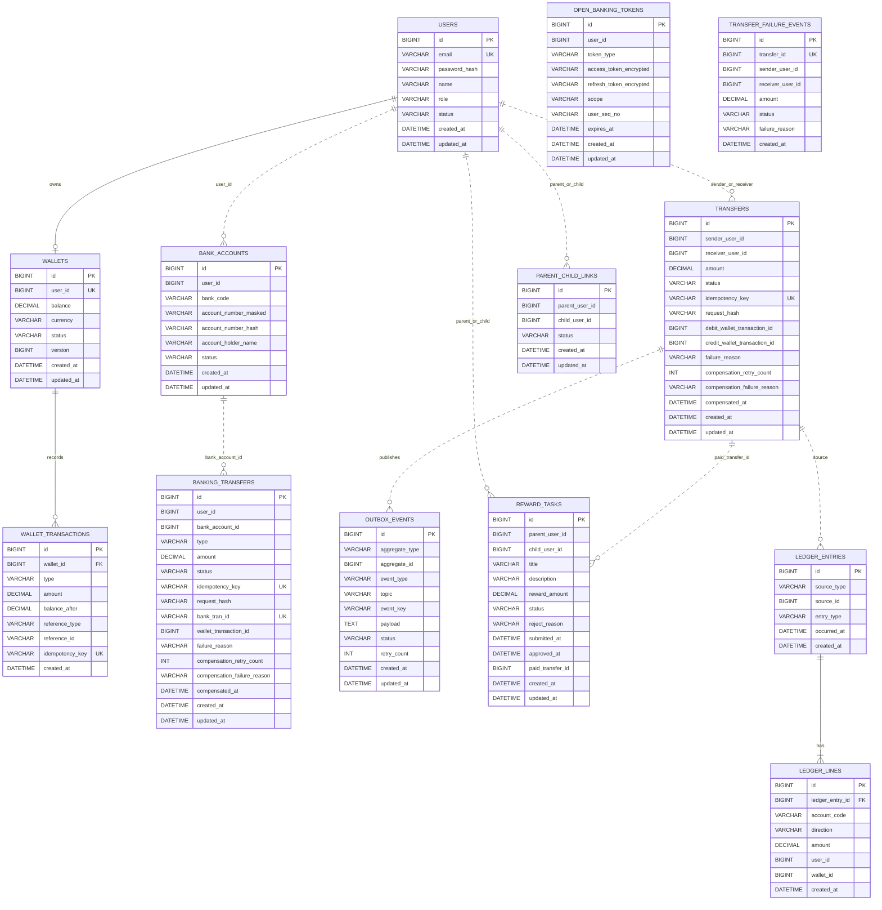

# ERD

PayFlow는 서비스별 DB를 분리합니다. 다른 서비스의 테이블을 직접 join하지 않고, 필요한 경우 API 호출이나 이벤트로 식별자만 주고받습니다.

## Databases

| DB | Owner |
| --- | --- |
| `payflow_user` | user-service |
| `payflow_wallet` | wallet-service |
| `payflow_banking` | banking-service |
| `payflow_transfer` | transfer-service |
| `payflow_reward` | reward-service |
| `payflow_ledger` | ledger-service |
| `payflow_settlement` | settlement-service |

## Mermaid ERD



## Core Tables

### users

사용자 계정, 역할, 상태를 저장합니다.

중요 제약:

- `email` unique
- `role`은 `PARENT`, `CHILD`
- 인증 이후 사용자 식별은 Gateway가 주입한 userId를 기준으로 처리

### wallets

사용자별 지갑 잔액의 단일 진실 공급원입니다.

중요 제약:

- `user_id` unique
- 금액은 `DECIMAL(19,0)` 또는 정수 원화 단위
- 잔액 변경은 wallet-service 트랜잭션 안에서 처리

### wallet_transactions

모든 지갑 잔액 변경 근거를 저장합니다.

중요 제약:

- `reference_type` + `reference_id`로 같은 원천 거래의 중복 반영 방지
- 입금/출금 결과와 변경 후 잔액을 기록

### banking_transfers

은행 계좌 충전/출금 요청 상태를 저장합니다.

중요 제약:

- `idempotency_key` unique
- `request_hash`로 같은 key에 다른 body가 들어오는 것을 방어
- `bank_tran_id`로 Open Banking 결과 조회와 wallet 반영을 연결
- 모호한 외부 응답은 즉시 실패로 단정하지 않고 `UNKNOWN`, `BANK_PROCESSING`, `COMPENSATION_REQUIRED` 등으로 분리

### transfers

사용자 간 지갑 송금을 저장합니다.

중요 제약:

- `idempotency_key` unique
- `request_hash` 저장
- 출금 성공 후 입금 실패 시 `COMPENSATION_REQUIRED`로 격리
- 보상 성공 시 `COMPENSATED`

### outbox_events

송금 상태 변경과 이벤트 발행 의도를 같은 DB 트랜잭션에 저장하기 위한 테이블입니다.

상태:

```text
PENDING -> PROCESSING -> PUBLISHED
PENDING -> PROCESSING -> FAILED -> PROCESSING
```

### reward_tasks

미션과 보상 지급 상태를 저장합니다.

상태:

```text
CREATED -> SUBMITTED -> APPROVED -> PAID
SUBMITTED -> REJECTED
CREATED -> CANCELED
```

### ledger_entries / ledger_lines

송금 완료 이벤트를 기반으로 복식부기 형태의 원장 기록을 저장합니다.

규칙:

- 같은 source는 한 번만 기록
- 차변 합계와 대변 합계는 같아야 함
- 원장은 수정하지 않고 보정이 필요하면 새 이벤트/새 기록으로 표현

## Modeling Decisions

| 결정 | 이유 |
| --- | --- |
| 서비스별 DB 분리 | MSA 경계와 소유권을 명확히 하기 위해 |
| cross-service FK 미사용 | 다른 서비스 DB에 직접 의존하지 않기 위해 |
| wallet-service 단일 잔액 소유 | 금액 정합성 책임을 한 곳에 모으기 위해 |
| transaction reference 저장 | 같은 원천 거래의 잔액 중복 반영을 막기 위해 |
| outbox 테이블 사용 | DB 변경과 Kafka 발행 사이의 유실을 줄이기 위해 |
| transfer failure 별도 저장 | 실패 이벤트도 추적 가능하게 하기 위해 |
