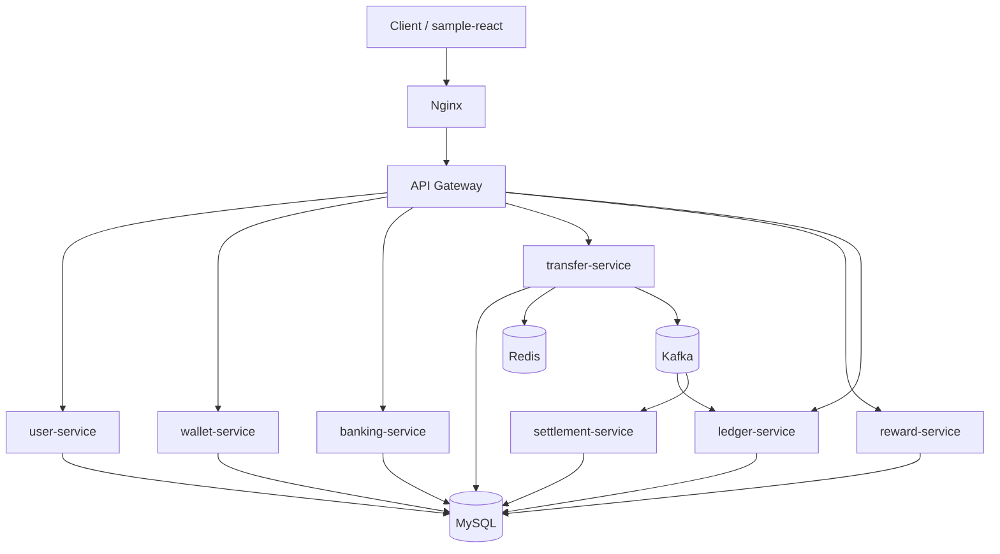
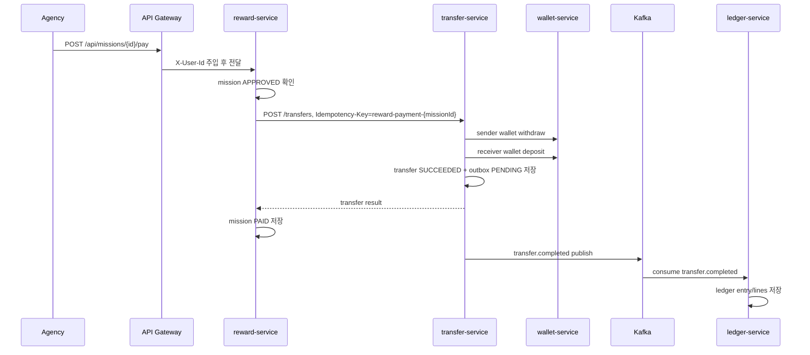

# Architecture

> 도메인 전환 안내: 현재 PayFlow는 **청년 정책 참여 미션 및 지원금 지급 플랫폼**으로 설명한다. 내부 구현 호환성을 위해 `PARENT`/`CHILD`, `/api/families`, `/api/missions`, `/api/cashbook`, `reward-service` 같은 명칭은 유지하지만, 문서와 발표에서는 각각 **기관 담당자**, **청년 참여자**, **참여자 연결**, **정책 미션**, **지원금 사용 내역**, **정책 미션/지원금 서비스**로 해석한다.

PayFlow는 API Gateway 중심의 MSA 구조입니다. 외부 요청은 Gateway를 통과하고, 각 서비스는 자기 도메인의 데이터만 직접 소유합니다.

## High-Level Architecture



## Service Boundaries

| Service | Owns | Does Not Own |
| --- | --- | --- |
| user-service | 사용자 계정, 인증 | 지갑 잔액 |
| wallet-service | 지갑 잔액, 거래 이력 | 미션, 송금 상태 |
| banking-service | 계좌, 은행 거래 상태 | 최종 지갑 잔액 |
| transfer-service | 송금 상태, outbox | 원장 저장 |
| reward-service | 참여자 연결, 미션 상태 | 직접 잔액 변경 |
| ledger-service | 송금 이벤트 기반 원장/실패 추적 | 송금 실행 |

## Request Flow

### Authentication

```text
Client
-> API Gateway
   -> JWT 검증
   -> 외부 X-User-* 헤더 제거
   -> 검증된 X-User-Id, X-User-Role 주입
-> Target Service
```

이 구조의 목적은 사용자가 임의로 내부 사용자 헤더를 조작해 다른 사용자 요청을 수행하는 것을 막는 것입니다.

### Mission Reward Payment



## Consistency Strategy

PayFlow는 모든 일을 하나의 분산 트랜잭션으로 묶지 않습니다. 대신 각 단계의 책임과 복구 방식을 명확히 나눕니다.

| 문제 | 전략 |
| --- | --- |
| 같은 요청 반복 | `Idempotency-Key` + `requestHash` |
| 지갑 중복 반영 | `wallet_transactions.idempotency_key` UNIQUE |
| 송금 중 동시 출금 | Redis lock + DB transaction |
| 이벤트 발행 유실 | transactional outbox |
| 이벤트 중복 소비 | ledger-service `UNIQUE(source_type, source_id)` |
| 외부 은행 응답 모호함 | `BANK_PROCESSING`, 지수 백오프 result-check |
| 송금 출금 후 입금 실패 | `COMPENSATION_REQUIRED`, `/compensations/{id}/refund` |
| Toss 승인 후 지갑 입금 실패 | `COMPENSATION_REQUIRED`, `/charges/{id}/compensate` |
| 지갑 입금 후 원장 기록 실패 | `ledger_recorded=false`, `/charges/{id}/ledger-compensate` |
| Toss 웹훅 중복 수신 | `toss_payment_events.event_idempotency_key` UNIQUE |

## Transactional Outbox

송금 완료 후 곧바로 Kafka를 발행하면 DB commit과 Kafka publish 사이에 장애가 생길 수 있습니다.

PayFlow는 다음 순서를 사용합니다.

```text
1. transfer 상태 변경
2. outbox_events row 저장
3. DB transaction commit
4. relay가 PENDING 이벤트 조회
5. PROCESSING으로 claim
6. Kafka publish
7. PUBLISHED로 변경
```

발행 실패 시:

```text
PROCESSING -> FAILED
retry_count 증가
max retry 전까지 재시도
오래 걸린 PROCESSING은 stale로 판단해 복구
```

## Open Banking Design

Open Banking 연동에서 중요한 점은 HTTP 200을 곧바로 금융 거래 성공으로 보지 않는 것입니다.

PayFlow는 외부 은행 응답을 아래처럼 분리합니다.

| Case | Handling |
| --- | --- |
| 명시적 성공 | 지갑 반영 단계로 이동 |
| 명시적 실패 | 실패 상태와 사유 저장 |
| 처리 중 | `BANK_PROCESSING` 상태로 유지, 스케줄러가 결과 재조회 |
| timeout/ambiguous | `BANK_PROCESSING`으로 저장, 지수 백오프 재조회 |
| 권한 없는 API | business state를 성공으로 바꾸지 않음 |

오픈뱅킹 계좌 연결 흐름:

```text
GET  /api/bank/openbanking/authorize-url   -> OAuth 인가 URL 발급, open_banking_authorizations 생성
POST /api/bank/openbanking/callback        -> 토큰 교환, open_banking_tokens 저장 (암호화)
POST /api/bank/openbanking/accounts/sync   -> 계좌 목록 조회, bank_accounts 저장
POST /api/bank/deposits                    -> 오픈뱅킹 출금이체 → 지갑 입금
POST /api/bank/withdrawals                 -> 오픈뱅킹 입금이체 → 지갑 출금
```

## Toss PG Design

Toss 결제 위젯을 이용한 지원금 예산 충전 흐름입니다.

```text
POST /api/payments/toss/charges    -> payment_charges + toss_payment_orders 생성 (READY)
POST /api/payments/toss/confirm    -> Toss 승인 API 호출 → wallet credit → ledger 기록
POST /api/payments/toss/webhook    -> Toss 웹훅 수신, toss_payment_events 저장
POST /api/payments/toss/payments/{paymentKey}/cancel -> Toss 취소 → wallet debit → ledger 기록
```

장애 보상 흐름:

| 장애 | 상태 | 복구 API |
| --- | --- | --- |
| Toss 승인 후 지갑 입금 실패 | `payment_charges.status = COMPENSATION_REQUIRED` | `POST /charges/{id}/compensate` |
| 지갑 입금 후 원장 기록 실패 | `payment_charges.ledger_recorded = false` | `POST /charges/{id}/ledger-compensate` |

운영 모니터링:

```text
GET /api/payments/toss/operations/summary              -> 상태별 건수, 보상 필요 건수
GET /api/payments/toss/operations/compensations        -> COMPENSATION_REQUIRED 목록
GET /api/payments/toss/operations/ledger-compensations -> 원장 미기록 목록
```

## Failure Recovery

### 송금 실패

출금 전 실패:

```text
REQUESTED -> FAILED
```

출금 후 입금 실패:

```text
PROCESSING -> COMPENSATION_REQUIRED
-> refund success
-> COMPENSATED
```

### 은행 출금 보상

은행 출금 API 권한 또는 모호한 결과로 최종 상태를 신뢰할 수 없으면 지갑 환불 보상 API로 복구합니다.

```text
COMPENSATION_REQUIRED
-> wallet deposit referenceType=OPEN_BANKING_REFUND
-> COMPENSATED
```

## Why This Architecture Fits A Portfolio

이 프로젝트는 결제 도메인의 핵심 질문을 작게 구현합니다.

- 돈이 두 번 움직이지 않게 하려면 어떤 키가 필요한가?
- 서비스가 나뉘었을 때 DB 정합성은 어디서 책임지는가?
- Kafka 발행 실패와 중복 소비는 어떻게 다루는가?
- 외부 금융 API의 모호한 응답을 어떻게 상태로 표현하는가?
- 장애가 났을 때 어떤 데이터로 추적하고 복구할 수 있는가?

