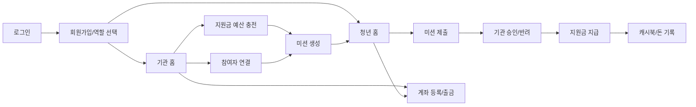

# 화면 흐름

> 도메인 전환 안내: 현재 PayFlow는 **청년 정책 참여 미션 및 지원금 지급 플랫폼**으로 설명한다. 내부 구현 호환성을 위해 `PARENT`/`CHILD`, `/api/families`, `/api/missions`, `/api/cashbook`, `reward-service` 같은 명칭은 유지하지만, 문서와 발표에서는 각각 **기관 담당자**, **청년 참여자**, **참여자 연결**, **정책 미션**, **지원금 사용 내역**, **정책 미션/지원금 서비스**로 해석한다.

PayFlow의 화면 흐름은 기관 담당자와 청년 참여자의 역할을 나누고, 정책 미션 지원금 지급까지의 핵심 여정을 보여주는 데 초점을 둡니다.

## 주요 사용자

| 사용자 | 목적 |
| --- | --- |
| 기관 담당자 | 청년 참여자 연결, 정책 미션 생성, 제출 확인, 승인/반려, 지원금 지급 |
| 청년 참여자 | 기관과 연결, 정책 미션 확인, 완료 제출, 지원금 확인 |

## 전체 사용자 여정



## 화면 목록

현재 mockup/rendered asset 기준으로 사용할 수 있는 화면입니다.

| 번호 | 화면 | 파일 예시 |
| --- | --- | --- |
| 01 | 로그인 | `sample-react/assets/mockups/rendered/01-login.png` |
| 02 | 회원가입 역할 선택 | `sample-react/assets/mockups/rendered/02-signup-role.png` |
| 03 | 참여자 연결 | `sample-react/assets/mockups/rendered/03-family-link.png` |
| 04 | 기관 연결 코드 | `sample-react/assets/mockups/rendered/04-child-invite-code.png` |
| 05 | 기관 홈 | `sample-react/assets/mockups/rendered/05-parent-home.png` |
| 06 | 지원금 예산 충전 | `sample-react/assets/mockups/rendered/06-credit-charge.png` |
| 07 | 미션 생성 | `sample-react/assets/mockups/rendered/07-mission-create.png` |
| 08 | 청년 홈 | `sample-react/assets/mockups/rendered/08-child-home.png` |
| 09 | 미션 제출 | `sample-react/assets/mockups/rendered/09-mission-submit.png` |
| 10 | 기관 승인 | `sample-react/assets/mockups/rendered/10-parent-approval.png` |
| 11 | 반려 후 재제출 | `sample-react/assets/mockups/rendered/11-reject-resubmit.png` |
| 12 | 계좌 등록 | `sample-react/assets/mockups/rendered/12-bank-account-register.png` |
| 13 | 청년 출금 | `sample-react/assets/mockups/rendered/13-child-withdrawal.png` |

## 기관 담당자 흐름

```text
로그인
-> 기관 홈
-> 청년 참여자 연결
-> 계좌 등록
-> 지원금 예산 충전
-> 미션 생성
-> 청년 제출 확인
-> 승인 또는 반려
-> 지원금 지급
-> 캐시북 확인
```

### 기관 홈

기관 홈은 다음 정보를 보여주는 것이 좋습니다.

- 현재 지원금 예산 잔액
- 연결된 청년 참여자
- 승인 대기 미션 수
- 이번 달 지급한 보상 합계
- 최근 미션/거래 내역

### 미션 생성

기관 담당자가 청년 참여자, 제목, 설명, 지원금 금액을 입력합니다.

API:

```http
POST /api/missions
```

### 기관 승인

청년이 제출한 미션을 확인하고 승인 또는 반려합니다.

API:

```http
PATCH /api/missions/{missionId}/approve
PATCH /api/missions/{missionId}/reject
POST  /api/missions/{missionId}/pay
```

중요 UX:

- 승인과 지원금 지급은 사용자가 이해할 수 있게 연결되어야 합니다.
- 지급 실패 시 단순 오류보다 재시도/상태 확인 경로가 필요합니다.

## 청년 참여자 흐름

```text
로그인
-> 청년 홈
-> 기관 연결 확인
-> 미션 목록 확인
-> 완료 제출
-> 승인/반려 결과 확인
-> 보상 입금 확인
-> 출금 요청
```

### 청년 홈

청년 홈은 다음 정보를 보여주는 것이 좋습니다.

- 현재 지갑 잔액
- 진행 중인 미션
- 제출한 미션 상태
- 지급 완료 보상
- 최근 돈 기록

### 미션 제출

청년은 완료한 미션을 제출합니다.

API:

```http
PATCH /api/missions/{missionId}/submit
```

### 반려 후 재제출

기관 담당자가 반려한 경우 반려 사유를 확인하고 다시 제출할 수 있는 흐름을 제공합니다.

## 계좌/오픈뱅킹 흐름

### 계좌 등록

```text
계좌 정보 입력
-> masking/hash 처리
-> bank_accounts 저장
```

API:

```http
POST /api/bank/accounts
GET  /api/bank/accounts
```

### 충전

```text
기관 계좌 선택
-> 충전 금액 입력
-> Open Banking withdraw transfer
-> 은행 성공 확인
-> wallet deposit
```

API:

```http
POST /api/bank/deposits
```

## 화면과 백엔드 연결 요약

| 화면 | 주요 API |
| --- | --- |
| 로그인 | `POST /api/users/login` |
| 회원가입 | `POST /api/users` |
| 기관 홈 | `GET /api/cashbook/parent/summary` |
| 참여자 연결 | `POST /api/families/links`, `GET /api/families/children` |
| 지원금 예산 충전 | `POST /api/bank/deposits` |
| 미션 생성 | `POST /api/missions` |
| 청년 홈 | `GET /api/missions`, `GET /api/cashbook/children/{childUserId}/summary` |
| 미션 제출 | `PATCH /api/missions/{missionId}/submit` |
| 기관 승인 | `PATCH /api/missions/{missionId}/approve`, `POST /api/missions/{missionId}/pay` |
| 반려 | `PATCH /api/missions/{missionId}/reject` |
| 계좌 등록 | `POST /api/bank/accounts` |
| 출금 | `POST /api/bank/withdrawals` |

## 포트폴리오에 보여주기 좋은 구성

1. contact sheet 이미지
2. 기관 담당자 여정 5장: 홈 -> 충전 -> 미션 생성 -> 승인 -> 캐시북
3. 청년 참여자 여정 4장: 홈 -> 제출 -> 반려/재제출 -> 지원금 확인
4. 화면 옆에 연결 API와 상태 전이를 짧게 표기

## 블로그용 메시지

화면은 단순히 예쁘게 만드는 목적이 아니라, 백엔드의 상태 모델을 사용자가 이해할 수 있게 드러내는 역할을 합니다. 특히 결제성 흐름에서는 "처리 중", "승인 대기", "지원금 지급 완료", "보상 필요" 같은 상태를 화면에서 숨기지 않는 것이 중요합니다.
## Toss PG / Open Banking 화면 확장 계획

기존 충전 화면은 계좌 기반 충전을 중심으로 구성되어 있다. 다음 단계에서는 기관 홈과 충전 화면을 다음처럼 확장한다.

### 기관 홈

- 지갑 잔액 영역에 `Toss 충전` 버튼을 추가한다.
- 연결 계좌가 없으면 `Open Banking 계좌 연결` 버튼을 노출한다.
- 연결 계좌가 있으면 `계좌 충전` 버튼을 함께 노출한다.
- 최근 충전 상태에 `처리 중`, `완료`, `실패`, `복구 필요`를 표시한다.

### 충전 화면

```text
충전 방식 선택
-> Toss
   -> 금액 입력
   -> Toss 결제 위젯
   -> 승인 callback
   -> 충전 완료/실패 상태 확인
-> 연결 계좌
   -> Open Banking 연결 계좌 선택
   -> 금액 입력
   -> 계좌 출금 기반 충전
   -> 결과 조회
```

### 계좌 연결 화면

- 기본 CTA는 `Open Banking으로 계좌 연결`이다.
- callback 완료 후 연결 계좌 목록을 보여준다.
- 계좌번호 직접 입력은 개발/테스트용 보조 동선으로 유지한다.

### 추가 연결 API

| 화면 | 주요 API |
| --- | --- |
| Toss 충전 생성 | `POST /api/payments/toss/charges` |
| Toss 승인 | `POST /api/payments/toss/confirm` |
| Toss 충전 상태 | `GET /api/payments/toss/charges/{chargeId}` |
| Open Banking 인증 URL | `GET /api/bank/openbanking/authorize-url` |
| Open Banking callback | `POST /api/bank/openbanking/callback` |
| 연결 계좌 동기화 | `POST /api/bank/openbanking/accounts/sync` |


